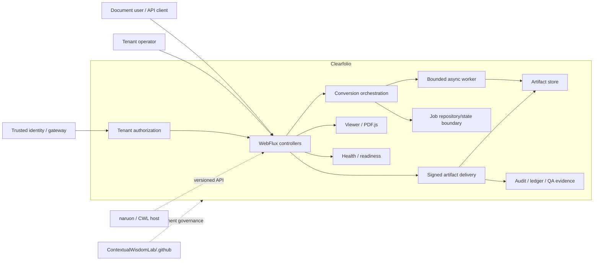
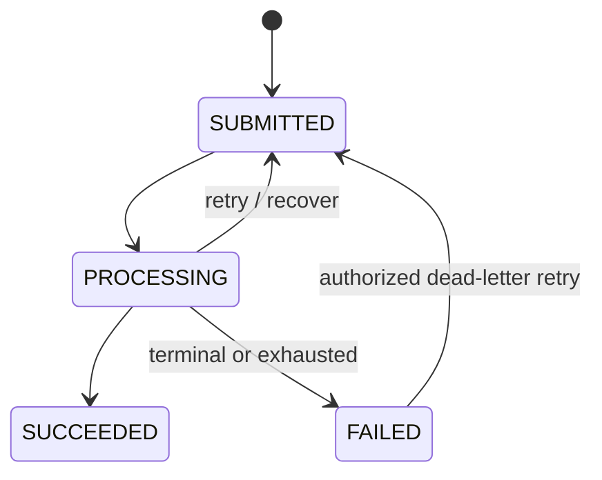

# Clearfolio Architecture

Last updated: 2026-08-10
Canonical documentation baseline: protected `main` at `f3cc09a9838f0f88c81a2ceae22138fab80a2edb`

## Purpose and status vocabulary

Clearfolio is an independently deployable secure document-conversion and viewing service that can also compose with naruon and other ContextualWisdomLab hosts through explicit versioned interfaces.

This architecture distinguishes:

- `IMPLEMENTED_ON_MAIN`: protected default-branch behavior;
- `ACTIVE_PR`: implemented only in an open PR and not yet shipped;
- `PARTIAL`: useful protected-main subset exists but the product contract is incomplete;
- `ACCEPTED_ARCHITECTURE`: agreed boundary without complete protected-main implementation;
- `PLANNED`: backlog work.

Historical MVP PRD/TRD/plans remain useful provenance but do not override this map, `docs/PRD.md`, `docs/TRD.md`, or live protected code.

## Product and trust topology



Uploaded documents, document-derived strings, browser data, model output and PR text are untrusted input. Clearfolio server-side deterministic code remains authority for conversion validation, tenant authorization, artifact delivery, fidelity acceptance and release gates.

## Protected-main runtime components

### HTTP layer

- `ConversionController`
  - asynchronous submit;
  - job status;
  - dead-letter retry;
  - delete/direct-download/viewer bootstrap surfaces according to the current code;
  - tenant and permission checks before protected state access.
- `ArtifactController`
  - signed artifact-link issuance and revocation;
  - artifact-read audit retrieval;
  - signed PDF delivery with token/checksum/revocation validation;
  - zero-or-one HTTP byte range support.
- `ViewerUiController`
  - HTML/PDF.js viewer shell.
- `ApiExceptionHandler`
  - controlled API failure mapping.
- health/availability controller(s)
  - protected main currently exposes the existing health surface; explicit liveness/readiness split is `ACTIVE_PR` #295.

### Authorization and security

- `TenantContext`, `TenantAccessService`, `TenantPermissions`
  - request tenant/subject/permission boundary and same-tenant checks;
  - HMAC-signed claim configuration exists in the current scaffold; active stack hardens production fail-closed behavior.
- `ArtifactLinkService`
  - short-lived signed artifact-read claims tied to token id, tenant, subject, document, scope, purpose, checksum, issue and expiry times;
  - issued-token ledger, revocation, checksum binding and read audit.

`ACTIVE_PR` #270/#268 strengthens signed claims, dedicated least privilege, key separation, HMAC audit pseudonymization, immutable lifecycle identity and admin/deletion boundaries.

### Conversion and lifecycle

- `DefaultDocumentConversionService`
  - validation, content identity/dedupe, job state, enqueue and artifact orchestration.
- `DefaultDocumentValidationService`
  - blocked-format and size/policy boundary.
- `DefaultConversionWorker`
  - bounded async execution, retry/dead-letter behavior and recovery against state available in the configured repository.
- `ConversionJob` / `ConversionJobStatus`
  - public lifecycle uses `SUBMITTED`, `PROCESSING`, `SUCCEEDED`, `FAILED`; dead-letter exhaustion is represented with evidence/flag rather than a new public terminal enum.

### State and artifacts

- `InMemoryConversionJobRepository`
  - protected-main default job state and content-hash dedupe boundary; process-local by default.
- `FileSystemArtifactStore`
  - configurable local filesystem artifact persistence plus read cache.
- `InMemoryArtifactStore`
  - test/development artifact mode.
- append-only/file-backed ledgers
  - selected artifact-link and analytics evidence can survive restart when configured.

These persistence choices do **not** establish a durable distributed job system. SQL-backed lifecycle state, distributed idempotency/backpressure/cancellation and remote-object-store transaction/fencing remain `PLANNED`, while deletion-receipt hardening is `ACTIVE_PR` #268.

## Conversion truth and fidelity boundary

### `IMPLEMENTED_ON_MAIN`

- validated PDF passthrough can preserve original PDF bytes in the artifact path;
- PDF.js renders controlled PDF artifacts.

### `PARTIAL`

`PdfBoxArtifactGenerator` can generate a placeholder one-page PDF for non-PDF sources. This is development/demo behavior and **not** a production-fidelity DOCX/HWP/Office conversion implementation.

### `ACTIVE_PR` / `PLANNED`

Draft #306 defines a provider-neutral `OfficeConversionAdapter`, source preflight and post-provider PDF publication checks. The production Office runtime remains `PLANNED`: a sandboxed sidecar or independently operated remote service must own Office-process execution outside the API-container trust boundary. The deterministic fixture adapter is an offline contract oracle, not a production Office engine.

Each advertised transformed source format must have a qualified deterministic converter and realistic authorized fixture suite proving structure/rendering/security/failure expectations. Macro/active-content execution and implicit external resource fetching are not accepted production authority paths. Unsupported or unverifiable inputs fail closed instead of silently producing a placeholder branded as successful conversion.

See ADR-0005, `docs/FIDELITY_ACCEPTANCE.md`, issue #5, `docs/UML.md`, `docs/DATA_MODEL.md`, and the fidelity requirements in `docs/PRD.md` / `docs/TRD.md`.

## Artifact delivery authority

Canonical protected-main artifact delivery uses:

```text
tenant/job state
→ artifact bytes
→ signed token resolution
→ signature / expiry / scope / doc checks
→ issued-token ledger / revocation
→ tenant + current artifact checksum binding
→ single-range resolution
→ controlled read audit
→ 200 / 206 / controlled failure
```

Dedicated tenant permission and signed artifact-token authority are separate controls where both apply. The direct conversion-job download endpoint is currently under `ACTIVE_PR` remediation to match this contract; permission-only direct byte delivery is not the accepted final architecture.

## Lifecycle and recovery

Current protected-main state machine:



`ACTIVE_PR` #268 adds restart-safe artifact deletion receipts, immutable lifecycle generations, generation-fenced cleanup, durable failed-attempt evidence, replay validation and recovery fairness. Do not treat those semantics as protected-main behavior until integration.

`docs/MIGRATION_ROLLBACK.md` is the canonical compatibility/recovery authority for file-ledger, artifact-store, converter/runtime, future SQL and public-contract changes. It explicitly distinguishes current process-local job state from future persistent architecture and forbids rollback that re-enables a known authorization bypass.

## Accessibility

Protected main has a responsive viewer/demo shell and PDF.js path. `ACTIVE_PR` #264 adds contextual names for repeated actions and reusable nested/reentrant busy-state semantics that preserve original DOM node identity, disabled state and ARIA attributes. Broader keyboard/screen-reader/print/export acceptance remains product work.

## Availability

Protected main has an existing health endpoint. `ACTIVE_PR` #295 separates process liveness from traffic readiness so routing can stop without unnecessary process restart and probe responses remain low-information/no-store. Shared dependency health must not turn liveness into a restart cascade.

## Standalone / MSA ownership

Clearfolio owns:

- document validation and conversion contract;
- conversion-job and artifact interfaces;
- local tenant authorization enforcement;
- artifact token/delivery semantics;
- product-specific audit/evidence contracts;
- its own migrations/state adapters when durable persistence is introduced.

A host such as naruon may own:

- higher-level user/product workflow;
- upstream identity/federation and trusted claim exchange;
- integration orchestration and deployment composition.

A host does not write Clearfolio application persistence directly. `contextual-orchestrator` may be used for explicitly model-backed features outside deterministic conversion/authorization authority; Clearfolio remains usable without it.

## Development automation architecture

### Central PR maintenance

`ACCEPTED_ARCHITECTURE`: privileged PR review/repair/exact-head gate/protected-merge automation belongs to `ContextualWisdomLab/.github`. Clearfolio should use thin contracts/callers instead of copying central reviewer/merge authority.

### Local product development (`ACTIVE_PR` #271)

The local OpenCode path:

1. refetches open PR/path/base state;
2. performs RCA → distinct remedies → real-world feasibility;
3. proposes one bounded path-disjoint change;
4. treats model output as untrusted patch data;
5. runs full verification in a fresh credential-free environment;
6. publishes only a Draft with short-lived scoped authority;
7. never self-approves, merges, releases or deploys.

Model-backed development uses GitHub Secret `NVIDIA_NIM_API_KEY`, never `COPILOT_GITHUB_TOKEN` as a development-model credential, and preserves independent reviewer credentials.

The loop is work-conserving: queued checks, review latency, external approval, a failed first remedy, one completed documentation artifact or one green PR blocks only that action. It rotates to the next safe item and requires two fresh exit sweeps before a normal no-work termination.

## Evidence and merge authority

The following are distinct and never collapsed:

- exact source revision;
- independently resolved current base revision;
- CI/security/fuzz/check evidence;
- commit status evidence;
- model/advisory review evidence;
- formal GitHub review/approval evidence;
- synthetic merge compatibility;
- protected-main operational evidence.

PR-body SHAs and old run IDs are historical narrative. Any head movement invalidates predecessor-head assumptions. See ADR-0007.

## Quality / release gates

Canonical full local acceptance begins with:

```bash
mvn -B --no-transfer-progress verify
python3 scripts/verify_maven_test_reports.py
```

Required policy includes:

- zero skipped/failing/error test-report evidence and positive executed count;
- exact 100% owned production line/branch acceptance;
- warning-free public Javadocs;
- required CI/security/SAST/fuzz checks for the unchanged candidate revision;
- no unresolved valid review findings;
- qualifying independent approval when policy requires it;
- realistic fidelity and accessibility evidence for release claims;
- SBOM/attribution/provenance/reproducibility;
- migration/rollback/recovery and protected-main operational evidence when applicable.

Queued, pending, skipped-required, cancelled, absent, stale-head, predecessor-head, synthetic-only, status-only and model-only outcomes are not passing release evidence.

`docs/RELEASE_ACCEPTANCE.md` is the integrated release authority. It requires one exact protected source/artifact identity and keeps source-head, live-base, workflow, review, security, fidelity/recovery and SBOM/provenance evidence separate instead of inferring release readiness from one green PR or status.

## Canonical documentation spine

Core product/architecture graph:

- `docs/PRD.md` — product users, outcomes, scope, fidelity and release requirements.
- `docs/TRD.md` — current/active/target technical contracts.
- `ARCHITECTURE.md` — this system/trust/ownership map.
- `docs/adr/README.md` — status-bearing durable decisions.
- `docs/DATA_MODEL.md` — logical ERD and persistence ownership.
- `docs/UML.md` — component, sequence, lifecycle, failure and deployment diagrams.
- `docs/API_CONTRACT.md` — API authority/versioning/integration boundary.
- `docs/THREAT_MODEL.md` — current threat/trust model.
- `docs/TEST_STRATEGY.md` — TDD, security, fidelity, recovery and release test strategy.
- `docs/OPERABILITY.md` — startup, degraded behavior, recovery, backup/restore and release operations.
- `docs/TRACEABILITY.md` — requirement/ADR → implementation/test/PR/evidence map.
- `docs/RESEARCH_TRACEABILITY.md` — standards, primary technical sources and peer-reviewed methodological evidence.
- `docs/DOCUMENTATION_ASSESSMENT.md` — dated completeness and drift assessment.
- `docs/ACQUISITION_DILIGENCE.md` — current product/engineering/security/operability/license/IP/acquisition evidence and external-diligence boundary.
- `docs/engineering/acceptance-criteria.md` — executable engineering acceptance-gate authority and evidence semantics.

Release and change-acceptance authorities:

- `docs/FIDELITY_ACCEPTANCE.md` — transformed-format support/fidelity qualification and evidence taxonomy.
- `docs/MIGRATION_ROLLBACK.md` — state/ledger/artifact/converter/API migration, rollback and recovery contract.
- `docs/RELEASE_ACCEPTANCE.md` — exact integrated protected-head release, provenance and publication verification gate.

Supporting policy:

- root `SECURITY.md` — vulnerability reporting policy plus linked detailed security docs.

Legacy/detailed documents, including dated buyer-diligence scorecards and data-room snapshots, remain supporting historical evidence but must not contradict this canonical spine without an explicit status/supersession note.
