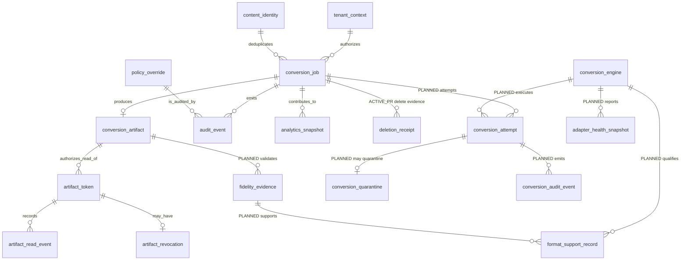
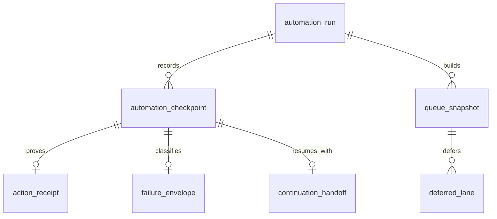
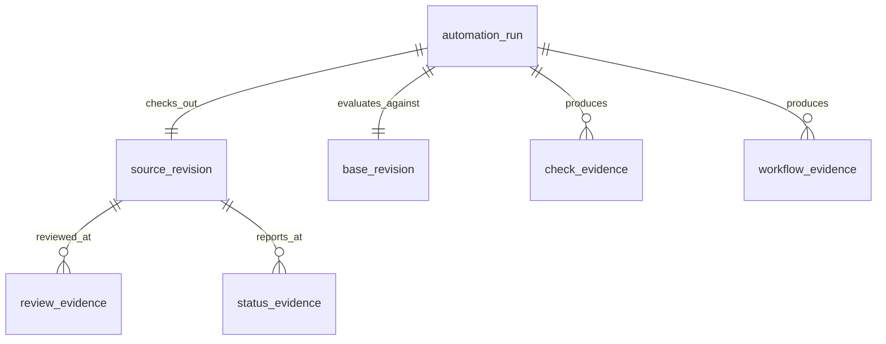

# Clearfolio Data and Domain Model

Status: Canonical logical model
Baseline: protected `main` at `83ec6f7fe2b04bdcd28bf98ec350e41e55730a18`

This document is a logical/ownership model, **not a claim that every entity is stored in PostgreSQL**. Clearfolio currently uses in-memory repository state plus selected filesystem and append-only ledger persistence. Future SQL/object-store work must preserve these domain identities and authority boundaries rather than inventing new semantic IDs during migration.

## Persistence legend

- `MEMORY`: current default runtime process memory.
- `FILE_ARTIFACT`: current filesystem artifact persistence when configured.
- `FILE_LEDGER`: current append-only/file-backed evidence when configured.
- `ACTIVE_PR`: persistence/lifecycle behavior exists only in an open PR.
- `CONCEPTUAL`: required logical entity for target architecture; no protected-main persistence claim.
- `HOST_OWNED`: external host concern; not Clearfolio application persistence.
- `EXTERNAL_CONTROL_PLANE`: evidence whose durable storage belongs to the executing scheduler/platform rather than the Clearfolio application.

## Logical entities

| Entity | Ownership / persistence | Purpose |
| --- | --- | --- |
| `tenant_context` | request-scoped; `HOST_OWNED` identity source, Clearfolio-enforced claims | tenant, subject and permission authority for a request |
| `conversion_job` | `MEMORY` on protected main | immutable job identity, tenant ownership, source metadata and lifecycle |
| `content_identity` | `MEMORY` index on protected main | content-hash dedupe identity scoped by current repository rules |
| `conversion_artifact` | `FILE_ARTIFACT` or memory | converted/passthrough PDF bytes and artifact metadata |
| `artifact_token` | runtime + optional `FILE_LEDGER` metadata | short-lived signed artifact-read authority tied to tenant, subject, document, checksum, scope and expiry |
| `artifact_read_event` | runtime + optional `FILE_LEDGER` | read audit following token verification |
| `artifact_revocation` | runtime + optional `FILE_LEDGER` | revocation evidence for an issued artifact token |
| `policy_override` | audit event / request evidence | explicit blocked-format exception intent; raw approval token is not durable audit output |
| `audit_event` | mixed current event/log/ledger surfaces | purpose-bound audit evidence; identifiers may be pseudonymized but remain personal data |
| `analytics_snapshot` | runtime + optional `FILE_LEDGER` | buyer/operations snapshot evidence; not a complete durable telemetry model |
| `deletion_receipt` | `ACTIVE_PR` #268 | generation-bound durable evidence for artifact deletion and cleanup recovery |
| `lifecycle_generation` | `ACTIVE_PR` #268 logical invariant | prevents stale retry/delete work from acting on a replacement lifecycle |
| `fidelity_evidence` | `CONCEPTUAL` / `PLANNED` | fixture, expected outcome, renderer version, source/artifact hashes and acceptance result for a supported-format claim |
| `conversion_engine` | `CONCEPTUAL` / `PLANNED` issue #5 | qualified Office-conversion provider/runtime identity, version, isolation profile, license/SBOM/provenance and support status |
| `conversion_attempt` | `CONCEPTUAL` / `PLANNED` issue #5 | one immutable job/generation/source-digest/engine/policy-bound conversion execution and typed outcome |
| `conversion_quarantine` | `CONCEPTUAL` / `PLANNED` issue #5 | controlled disposition of hostile, policy-denied, crashed or otherwise quarantined source/result evidence |
| `adapter_health_snapshot` | `CONCEPTUAL` / `PLANNED` issue #5 | bounded capacity/readiness/resource/process-health evidence for a qualified adapter runtime |
| `format_support_record` | `CONCEPTUAL` / `PLANNED` issue #5 | versioned format support tier, limitations and fidelity/security acceptance bound to an engine/policy version |
| `conversion_audit_event` | `CONCEPTUAL` / `PLANNED` issue #5 | privacy-safe Office attempt lifecycle evidence for accepted, rejected, timed-out, cancelled, crashed, retried, quarantined and completed outcomes |
| `automation_run` | GitHub/workflow/scheduler evidence; `CONCEPTUAL` locally | autonomous run identity, control version, and exact historical source/base evidence |
| `automation_checkpoint` | `CONCEPTUAL` / `EXTERNAL_CONTROL_PLANE`; issue #331 | last safe execution phase and exact historical evidence identity |
| `queue_snapshot` | `CONCEPTUAL` / `EXTERNAL_CONTROL_PLANE`; issue #331 | bounded fresh-state inventory used to select the next atomic action |
| `deferred_lane` | `CONCEPTUAL` / `EXTERNAL_CONTROL_PLANE`; issue #331 | branch-local wait keyed by exact PR/head/live-base/run/review identity |
| `action_receipt` | `CONCEPTUAL` / `EXTERNAL_CONTROL_PLANE`; issue #331 | proof that one atomic repository action completed at an exact evidence boundary |
| `failure_envelope` | `CONCEPTUAL` / `EXTERNAL_CONTROL_PLANE`; issue #331 | controlled observed failure phase/category without invented hidden cause or sensitive exception text |
| `continuation_handoff` | `CONCEPTUAL` / `EXTERNAL_CONTROL_PLANE`; issue #331 | privacy-safe next-run context that is historical and requires a full live refetch |
| `review_evidence` | GitHub-owned; `CONCEPTUAL` locally | independent review identity/state distinct from checks/status/model output |
| `naruon_contract` | versioned interface; `HOST_OWNED` orchestration | explicit host/service composition contract without cross-database access |

The Office qualification entities above are a logical vocabulary for issue #5 and active Draft #306. Their presence **does not imply a database table**, physical foreign key, durable SQL schema, deployed sidecar, approved remote service, or production Office-format support. PR #306 supplies `ACTIVE_PR` provider-neutral contract/publication-validation evidence; the production runtime qualification remains `PLANNED` until issue #5 acceptance is integrated.

The scheduler execution-receipt entities are likewise conceptual/external. Their presence **does not imply a database table** in Clearfolio. The executing external scheduler, central control plane, or a future repository-local workflow owns durable receipt storage when supported. Clearfolio owns only the semantic contract, privacy boundary, traceability, and tests unless a later accepted ADR explicitly changes persistence ownership.

## Core relationships

The diagram is conceptual. It deliberately does not imply foreign keys or a physical relational schema for entities that are currently in memory, filesystem ledgers, GitHub, host-owned systems, planned Office-adapter qualification evidence, or an external scheduler control plane.

## `conversion_job`

Required semantics:

- opaque UUID job identity;
- tenant ownership;
- original filename/content type/size metadata;
- content identity/dedupe linkage;
- lifecycle status (`SUBMITTED`, `PROCESSING`, `SUCCEEDED`, `FAILED`);
- retry/dead-letter evidence;
- created/started/completed/retry timing;
- immutable generation identity when durable mutation fencing is integrated.

A job UUID must never be rebound to another tenant or lifecycle generation merely because earlier metadata was deleted.

## `content_identity`

Protected main uses cryptographic content hashing for dedupe. A future durable implementation must define whether identity is tenant-scoped or otherwise privacy-safe before global dedupe is introduced. The hash must not be treated as anonymous data or exposed as an uncontrolled metric label.

## `conversion_artifact`

Minimum semantics:

- owner job identity;
- artifact media type;
- byte length;
- checksum/digest;
- origin (`passthrough`, `transformed`, `degraded`, or development-only placeholder);
- renderer/converter version when transformed;
- publication and deletion state;
- storage generation/version for remote object stores.

`FILE_ARTIFACT` on protected main means local disk durability only. It does not imply distributed object-store atomicity or durable job-state convergence.

## `artifact_token`

Signed-token claims include at least:

- token identifier;
- tenant identifier;
- subject identifier;
- document/job identifier;
- read scope;
- purpose;
- artifact checksum;
- issue time;
- expiry time;
- signature/version metadata.

Validation authority combines signature, expiry, scope, document binding, ledger presence, revocation, tenant ownership and current artifact checksum. Dedicated tenant permission and a valid artifact token are separate controls where both are required.

## `artifact_read_event`

A read event is emitted only after token verification and captures controlled audit fields such as token/document identity, range request, response status, trace identifier and read time. It must not record raw authorization headers or token secrets.

## `deletion_receipt` (`ACTIVE_PR`)

The target receipt binds:

- deletion request identity;
- tenant/job/lifecycle generation;
- pending or verified artifact checksum state;
- durable state transition;
- attempt count and last attempt time;
- controlled failure code;
- cleanup completion evidence.

A failed initial artifact read must not be misrepresented as confirmed absence. Recovery order must be reconstructable from durable evidence rather than process-local cursors.

## `fidelity_evidence` (`PLANNED`)

Recommended logical fields use two-or-more-word `snake_case` names:

- `fidelity_evidence_id`
- `source_fixture_id`
- `source_format_code`
- `source_content_hash`
- `converter_version`
- `artifact_content_hash`
- `expected_page_count`
- `structural_result`
- `visual_result`
- `extraction_result`
- `accessibility_result`
- `security_result`
- `accepted_difference`
- `verification_time`
- `source_commit_sha`

This entity becomes authoritative only after a persistence/evidence contract is implemented; until then it is a release-domain model.

## Office qualification model (`ACTIVE_PR` #306 / `PLANNED` issue #5)

The provider-neutral Java contract in Draft #306 is implementation evidence for the request/result boundary and post-provider PDF publication checks. The entities below describe the larger qualification domain that must still be proven before production Office support can be claimed.

### `conversion_engine`

Logical fields should bind at least:

- `conversion_engine_id`
- `adapter_contract_version`
- `engine_provider_code`
- `engine_runtime_version`
- `runtime_image_digest`
- `runtime_license_manifest`
- `runtime_sbom_digest`
- `runtime_provenance_digest`
- `isolation_policy_version`
- `qualification_status`

A `conversion_engine` describes a qualified execution boundary. It is not permission to start LibreOffice/JODConverter inside the API container.

### `conversion_attempt`

An attempt binds the exact immutable execution inputs and result identity, including:

- tenant and `conversion_job` identity;
- lifecycle generation;
- source format and source digest;
- `conversion_engine` and adapter version;
- conversion policy version;
- correlation/request identity;
- queue/start/finish timing;
- typed result/failure classification;
- output digest when publication validation succeeds.

Retry creates another bounded attempt; it must not rewrite the provenance of the earlier attempt.

### `conversion_quarantine`

Quarantine is a controlled state/evidence object for source or result material that must not continue through normal publication. It records a non-sensitive reason code, policy/engine identity, bounded retention/review state and cleanup outcome without exposing document content or local paths.

### `adapter_health_snapshot`

This low-cardinality evidence records whether a qualified runtime has bounded capacity to accept work and may include process count/age, queue depth, saturation class, crash/timeout counters and policy/configuration identity. It must not expose tenant or document identifiers as metric labels.

### `format_support_record`

A support record binds one source-format/version family to exact engine/policy/fidelity/security evidence and a support tier such as qualified, limited, unsupported or disabled. A successful process exit alone cannot create this record as qualified.

### `conversion_audit_event`

This logical Office-specific audit event narrows the generic `audit_event` purpose to one conversion attempt and records controlled lifecycle outcomes such as accepted, rejected, timed out, cancelled, crashed, retried, quarantined and completed. If future persistence unifies it with the generic audit ledger, that must be a reviewed schema decision rather than an implicit alias.

None of these conceptual names imply a database table. Future persistence may choose tables, events, object metadata or another durable representation, but it must preserve their semantic identity, tenant boundary and evidence provenance.

## Scheduler execution receipt model (`PLANNED`; issue #331)

The receipt domain makes external autonomous execution diagnosable without granting runtime authority to repository prose.

### `automation_checkpoint`

Minimum conceptual fields include:

- `automation_checkpoint_id`
- `automation_run_id`
- `control_version_digest`
- `execution_phase_code`
- `protected_main_sha`
- `source_head_sha`
- `live_base_tip_sha`
- `target_ref_name`
- `target_blob_sha`
- `last_action_code`
- `checkpoint_time`

All Git identities are historical after movement and must be refetched before another write.

### `action_receipt`

An action receipt binds one atomic action to its exact observable result. It may reference a commit, issue, PR state transition, workflow/run/check identity, thread resolution, or controlled no-mutation proof. It never means that another gate, approval, merge, release, or product requirement passed.

### `failure_envelope`

A failure envelope stores a controlled phase/category such as admission, queue construction, connector, permission, repository policy, provider, publication CAS, verification, or telemetry unavailable. It must not contain raw secrets, document content, tenant/subject identifiers, uncontrolled provider exception text, or an invented root cause.

### `continuation_handoff`

A continuation handoff identifies the last safe checkpoint, any branch-local deferred lanes, and the next permitted class of work. It cannot authorize a mutation. The next run must rebuild a fresh queue from live GitHub state.

### Receipt lifecycle

Storage remains `EXTERNAL_CONTROL_PLANE` unless a later accepted ADR assigns a repository-local durable implementation. No Clearfolio application database is introduced by ADR-0012.

## Automation/evidence model

GitHub evidence must keep authorities separate:

A green status does not become an independent approval; a synthetic merge does not become exact-head product proof; a PR-body SHA does not override live source revision; an action receipt does not become release or merge authority.

## Future physical persistence rules

When SQL persistence is added:

1. every Clearfolio-owned object name has at least two descriptive `snake_case` words;
2. tenant ownership is represented in keys/constraints, not reconstructed only in application filters;
3. lifecycle generation and idempotency keys participate in mutation predicates;
4. state transitions are transactional and append audit/outbox evidence atomically where required;
5. secrets and raw approval/token values are not persisted as ordinary business data;
6. migration and rollback tests prove tenant isolation and identity preservation;
7. no other CWL service may write Clearfolio tables directly;
8. external scheduler receipt entities remain external unless a new accepted ADR changes their ownership and supplies migration, retention, privacy, recovery, and rollback evidence.
