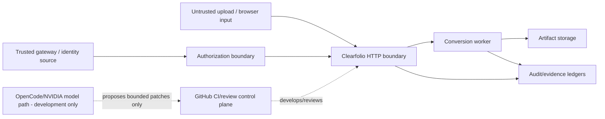

# Clearfolio Threat Model

Status: Canonical threat-model index
Baseline: protected `main` at `f3cc09a9838f0f88c81a2ceae22138fab80a2edb`

Root `SECURITY.md` remains the vulnerability-reporting policy. This document models product trust boundaries and links active hardening work without presenting it as shipped.

## Protected assets

- customer document bytes and converted artifacts;
- tenant, subject and authorization context;
- signed artifact tokens and signing keys;
- audit pseudonymization secrets and policy-signing secrets;
- conversion-job identity and lifecycle generation;
- artifact/analytics/deletion ledgers;
- source/build/SBOM/provenance evidence;
- reviewer, CI and automation credentials;
- fidelity fixtures and expected results.

## Trust boundaries

Uploaded documents and all document-derived strings are untrusted data. Model output is untrusted development proposal data. Neither can change authorization or release policy.

## Threat register

| Threat | Boundary / impact | Current/target mitigation |
| --- | --- | --- |
| cross-tenant IDOR | job/artifact/admin APIs disclose or mutate another tenant | same-tenant concealment `IMPLEMENTED_ON_MAIN`; stricter signed/admin mutation contracts `ACTIVE_PR` #268/#270 |
| artifact-token bypass | permission-only route returns document bytes without revocation/checksum/audit | canonical `/artifacts` signed delivery `IMPLEMENTED_ON_MAIN`; direct-download alignment `ACTIVE_PR` #270 |
| stale/replayed artifact token | old token reads changed/revoked artifact | expiry, ledger presence, revocation, doc/scope/tenant/checksum binding |
| malformed token/parser ambiguity | surplus delimiters, empty claims, malformed Base64/UUID/epoch alter verification semantics | strict parser hardening `ACTIVE_PR` #276; fail closed before authorization/ledger continuation |
| weak/shared cryptographic keys | one compromise crosses signing/audit purposes | key strength/separation `ACTIVE_PR` #270/#268; domain-separated HMAC pseudonyms |
| raw PII/secret audit leakage | approver, tenant, token or exception-selected data leaves protected boundary | purpose-bound pseudonymization and controlled failure codes; privacy review; no raw tokens |
| job UUID rebinding / stale mutation | old retry/delete work acts on a replacement lifecycle | permanent identity + generation fences `ACTIVE_PR` #268 |
| deletion evidence confusion | failed read interpreted as artifact absence, causing metadata loss | persist pending receipt first; confirmed digest/absence distinction `ACTIVE_PR` #268 |
| recovery starvation after restart | repeatedly failing oldest receipt blocks later cleanup | durable attempt transitions and replay-derived fairness `ACTIVE_PR` #268 |
| malicious/oversized document | CPU/memory/disk exhaustion, parser/converter exploit | upload bounds/fuzz/blocklist current; real converter must add sandbox/resource/active-content/no-network controls |
| macro/script/external-resource execution | document content gains code/network authority | forbidden in deterministic conversion architecture; real converter acceptance must prove boundary |
| placeholder fidelity overclaim | buyer believes non-PDF documents were faithfully converted | ADR-0005; release/support matrix; placeholder labelled development-only |
| path traversal / unsafe publication | attacker-controlled filename/path escapes artifact root | app-owned artifact paths, sanitization; future converter temp/publication tests |
| denial of service through queue | uncontrolled jobs exhaust workers | bounded executor current; durable backpressure/cancellation planned |
| liveness/readiness coupling | dependency outage causes restart storm or traffic to unready instance | separation `ACTIVE_PR` #295 |
| prompt injection in autonomous development | repository/document text changes agent authority or exfiltrates secret | model step is proposal-only, protected paths denied, credential-free verification, no self-merge `ACTIVE_PR` #271 |
| development credential leakage | model or logs expose `NVIDIA_NIM_API_KEY`/App tokens | GitHub Secrets only, model-step-only secret, short-lived scoped publisher, no raw secret echo |
| reviewer/approval spoofing | comment/status/model output treated as independent approval | evidence-class separation, exact-head formal review governance |
| stale-head merge evidence | old checks/reviews authorize moved code | ADR-0007 exact-head/live-base refetch and current-head gates |
| dependency/supply-chain compromise | malicious dependency/action/build artifact | immutable action/source pins where practical, SAST/security scan, SBOM/attribution/provenance |

## Data privacy model

Pseudonymization does not make audit data anonymous. Tenant/subject/artifact metadata remains purpose-limited personal/business data. Controls should prefer least privilege, selective disclosure, encryption, bounded retention and auditable privileged access rather than masking that prevents legitimate operations.

Never publish or use as low-cardinality metric labels without an explicit reviewed need:

- raw tenant/subject IDs;
- filenames or document paths;
- approval/artifact tokens or signatures;
- document content;
- uncontrolled document digests;
- exception-selected text/class names;
- local filesystem paths.

## Converter threat requirements (`PLANNED` real Office conversion)

A production converter must be treated as an untrusted-document execution boundary:

- macro and active-content execution disabled;
- external resource/network access denied by default;
- bounded CPU, memory, process count, output size and wall time;
- app-owned temporary directories with cleanup;
- no user-controlled executable path/argument injection;
- MIME/magic/container validation before processing;
- malformed archive/XML/relationship/bomb fixtures;
- least-privilege OS/container identity;
- converter/version provenance in fidelity evidence;
- deterministic controlled failure when safety cannot be established.

## Automation threat requirements

The product-development agent is not a trusted merge authority. It may read untrusted repository content to propose a bounded patch, but:

- permissions are fail-closed;
- credentials are not exposed to arbitrary verification code;
- model output cannot modify workflows, protected paths, binaries, symlinks or excessive file scope unless an explicitly reviewed contract says otherwise;
- a fresh credential-free runner verifies the immutable patch;
- publication uses short-lived minimum GitHub App authority;
- central review/merge authority remains independent.

## Incident reopening conditions

Reopen the threat model and relevant ADR when any of these changes:

- a new document parser/converter is added;
- persistence moves to SQL/object storage;
- identity moves to a new issuer/federation model;
- token claims or cryptographic purposes change;
- a new cross-service integration receives state or secret authority;
- an autonomous agent receives broader write/tool/network permissions;
- support/fidelity claims expand to a new format;
- release/provenance authority changes.

## Related security documents

- `SECURITY.md`
- `docs/security/2026-07-02-threat-model-data-handling.md`
- `docs/security/2026-07-02-auth-tenant-model.md`
- `docs/security/2026-07-02-signed-artifact-link-design.md`
- `docs/security/2026-08-04-audit-pseudonymization.md` when integrated with its source PR
- ADR-0002 through ADR-0004 and ADR-0007 through ADR-0010
