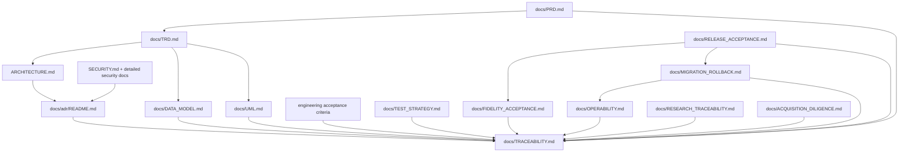

# Clearfolio Requirements and Evidence Traceability

Status: Canonical traceability index
Baseline: protected `main` at `83ec6f7fe2b04bdcd28bf98ec350e41e55730a18`

This matrix prevents recurring documentation errors: treating an active PR as shipped, treating a green status as independent review, treating a placeholder renderer as supported-format fidelity, allowing a buyer-visible gap to exist only in issue/PR prose, or treating a generic scheduler error as a proven hidden root cause.

## Product requirement traceability

| Requirement | Maturity | Primary implementation/evidence | Tests / gates | Governing docs / decisions |
| --- | --- | --- | --- | --- |
| bounded asynchronous submit | `IMPLEMENTED_ON_MAIN` | `ConversionController`, `DefaultDocumentConversionService`, `DefaultConversionWorker` | controller/service/concurrency tests; Maven verify | PRD FR-01; TRD §§2,4,5 |
| tenant-scoped job status | `IMPLEMENTED_ON_MAIN` | `TenantAccessService`, `ConversionController#getStatus`, repository | auth/controller/repository tests | PRD FR-02/06; ADR-0002 |
| signed viewer artifact delivery | `IMPLEMENTED_ON_MAIN` | `ArtifactLinkService`, `ArtifactController#getPdf`, artifact ledger | artifact token/range/revocation/read-audit tests | PRD FR-03; TRD §3; ADR-0002 |
| direct-download signed delivery | `ACTIVE_PR` #270 | `ConversionController#downloadArtifact` remediation | `ConversionDownloadAuthorizationTest` plus artifact delivery tests | PRD FR-03; ADR-0002; API_CONTRACT |
| content identity / dedupe | `IMPLEMENTED_ON_MAIN` | conversion service + repository hash index | service/repository concurrency tests | PRD FR-04; DATA_MODEL `content_identity` |
| blocked-format / upload bound | `IMPLEMENTED_ON_MAIN` | validation service, multipart limit | validation/fuzz/multipart tests | PRD FR-05; SECURITY/threat docs |
| signed tenant claims + admin least privilege | `ACTIVE_PR` #270/#268 | tenant/access/admin changes | strict-claims, tenant mutation, download auth tests | ADR-0002/0003; THREAT_MODEL |
| production OIDC/JWT identity federation | `PLANNED`; issue #314 | current HMAC-signed gateway claim mode remains a bounded adapter; provider-neutral verifier/issuer/audience/key-rotation/tenant-role mapping is not shipped | issuer/audience/algorithm/key-rotation/JWK outage/tenant mapping/migration/cross-tenant/artifact-authority tests required | issue #314; PRD production identity gap; API_CONTRACT; THREAT_MODEL; MIGRATION_ROLLBACK |
| runtime HMAC credential registry | `PLANNED`; issue #319; key readiness `ACTIVE_PR` #313 | protected main still sources tenant/artifact HMAC values from environment-backed application configuration; #313 hardens key readiness but does not replace runtime credential authority | registry lookup/rotation/restart/replica/least-privilege/no-secret-log tests plus preserved #313 readiness tests | issue #319; #313; AGENTS.md; SECURITY; THREAT_MODEL; MIGRATION_ROLLBACK |
| privacy-safe HMAC audit pseudonymization | `ACTIVE_PR` #270/#268 | `AuditPseudonymizer`, key separation guard, admin audit logger | key-strength/separation/privacy tests | ADR-0003 |
| immutable job identity and durable deletion | `ACTIVE_PR` #268; umbrella issue #263 | lifecycle/deletion receipt/coordinator/store | crash-tail, fairness, replay, generation, privacy tests; future integrated user-flow recovery tests | ADR-0004; DATA_MODEL `deletion_receipt`; MIGRATION_ROLLBACK |
| user-facing tenant-safe deletion flow | `PLANNED` after #270/#268/#264 integration; issue #263 | no integrated protected-main user lifecycle yet | delete idempotency, signed-link invalidation, restart/recovery, accessible UX tests required | PRD lifecycle requirements; MIGRATION_ROLLBACK; RELEASE_ACCEPTANCE |
| nested-safe accessible async viewer actions | `ACTIVE_PR` #264 | `dom-utils.js`, `demo.js` integration | JS unit/integration/coverage gates | PRD FR-09; UML viewer workflows |
| viewer render generation safety | `PARTIAL`; issue #322; bounded `ACTIVE_PR` #323 | #323 prevents superseded PDF.js work from publishing stale canvas/metadata/Ready state; active `RenderTask.cancel()`/loading-task destruction and broader signed-token/multi-generation parity remain planned | `test_viewer_render_cancellation.py`; exact-head CI/security/SAST/fuzz; successor cancellation/resource tests | issue #322; #323; UML viewer lifecycle; TEST_STRATEGY; OPERABILITY |
| robust keyboard focus appearance | `ACTIVE_PR` #325 under issue #324 | two independent black/white 3px `:focus-visible` bands replace the weak modern-browser mixed focus color | executable CSS contrast/geometry regression; exact-head CI/security/SAST/fuzz | issue #324; #325; WCAG 2.2 focus appearance; TEST_STRATEGY |
| liveness/readiness split | `ACTIVE_PR` #295 | availability controller/probe docs | startup/failure/recovery availability tests | ADR-0006; OPERABILITY |
| strict artifact-token structure | `ACTIVE_PR` #276 | `ArtifactLinkService` token parser boundary | boundary/fuzz/parser-evidence tests | ADR-0002; API_CONTRACT |
| analytics storage-level tenant isolation | `PLANNED`; issue #326; depends on #268 scoped repository API | protected main analytics still uses global `findAll()` then filters application-side; #268 provides the future fail-closed scoped query but does not adopt it in analytics | hostile global-query seam, scoped repository interaction, two-tenant KPI isolation and exact coverage tests required | issue #326; #268; ADR-0002; THREAT_MODEL; TEST_STRATEGY |
| terminal-outcome conversion success rate | `ACTIVE_PR` #328 under issue #327 | KPI response/persistence/export Javadocs use succeeded / (succeeded + failed), excluding submitted/processing | mixed terminal/in-flight RED→GREEN tests; exact-head CI/security/SAST/fuzz | issue #327; #328; API_CONTRACT; TEST_STRATEGY |
| finite/domain-valid persisted KPI evidence | `ACTIVE_PR` #330 under issue #329 | `KpiSnapshotLedger` rejects NaN/infinities, rates outside `[0,1]`, and negative p95 latency without clamping | invalid-ledger replay RED→GREEN tests; exact-head CI/security/SAST/fuzz | issue #329; #330; DATA_MODEL `analytics_snapshot`; TEST_STRATEGY |
| exact-head CI/test evidence | `ACTIVE_PR` #270 | CI workflow + Maven report verifier | workflow contract tests; exact-head CI/security/fuzz | ADR-0007; RELEASE_ACCEPTANCE |
| qualifying independent formal review route | `PLANNED`; issue #321; central `.github#772` ownership | live protection requires one approving review by a write-authorized reviewer; advisory bots remain non-counted and CODEOWNERS/human-team provisioning is external to the Clearfolio writer | protection probe, negative bot/author eligibility, human-team/CODEOWNERS/dismissal/offboarding acceptance | issue #321; `.github#772`; ADR-0007/0008; repository metadata; RELEASE_ACCEPTANCE |
| hourly RCA/feasibility product development | `ACTIVE_PR` #271 | hourly OpenCode workflow + contract tests | scheduler contract tests; credential-free verifier | ADR-0008/0009 |
| thin external scheduler control | `ACCEPTED_ARCHITECTURE`; docs `ACTIVE_PR` #305 | external scheduler delegates detailed authority to the canonical repository graph | `test_release_loop_adr_contract.py`; operational recurrence evidence | ADR-0011; OPERABILITY; ADR-0008/0009 |
| scheduler execution receipt and resumable continuation | `PLANNED`; issue #331; docs `ACTIVE_PR` #305 | external task currently exposes only a generic scheduled-task error; ADR-0012 defines `automation_checkpoint`, `action_receipt`, `failure_envelope`, `continuation_handoff`, and clean budget continuation without fake Clearfolio persistence | `test_scheduler_execution_receipt_documentation_contract.py`; future run/admission/queue/action/CAS/privacy/budget simulations | issue #331; ADR-0012; DATA_MODEL; UML; OPERABILITY |
| real Office conversion fidelity | `PLANNED`; issue #5 | no protected-main production transformed-format implementation | realistic authorized/redistributable fixture corpus, deterministic rendering/security/resource/provenance gates required | PRD fidelity contract; ADR-0005; FIDELITY_ACCEPTANCE; issue #5 |
| provider-neutral Office publication boundary | `ACTIVE_PR` #306 | `OfficeConversionAdapter`, immutable request/result binding and fail-closed PDF policy | adapter/provenance/output/page/action/URI/container policy tests; exact-head CI/security/fuzz | issue #5; ADR-0005; FIDELITY_ACCEPTANCE; `docs/UML.md`; `docs/DATA_MODEL.md` |
| durable distributed jobs/backpressure/cancellation | `PLANNED`; issue #312 | protected main uses process-local repository/executor/retry timers; no durable atomic accept+outbox/cancellation contract | crash/restart, idempotency, admission/backpressure, lease-fencing, duplicate-delivery, cancellation-race, migration/rollback tests required | PRD FR-11; ADR-0004; MIGRATION_ROLLBACK; OPERABILITY; issue #312 |
| privacy-safe OpenTelemetry | `PLANNED`; included in issue #312 execution/operability evidence | selected logs/analytics only | trace/metric cardinality/privacy/SLO tests required | TRD §8; OPERABILITY; ACQUISITION_DILIGENCE; issue #312 |
| naruon modular contract | `ACCEPTED_ARCHITECTURE` | HTTP/service interface boundary | compatibility/contract tests required as integration stabilizes | ADR-0001; Architecture; API_CONTRACT |
| complete versioned public API/schema + naruon compatibility | `PLANNED`; issue #315 | current controllers/API records plus partial buyer OpenAPI and prose API contract; no single complete released machine-readable schema authority yet | route/DTO/error/lifecycle/example/breaking-change/standalone+naruon consumer/version-negotiation tests required | issue #315; API_CONTRACT; ADR-0001; RELEASE_ACCEPTANCE |
| buyer OpenAPI license/example/delete-route integrity | `PARTIAL`; bounded `ACTIVE_PR` #316 under issue #315 | #316 aligns buyer OpenAPI with Apache-2.0 and removes demo-only example/route drift; it does not make the partial API/schema contract complete | buyer OpenAPI contract tests; exact-head CI/security | issue #315; #316; API_CONTRACT; ACQUISITION_DILIGENCE |
| production workspace / buyer-demo authority cleanup | `PLANNED`; issue #317; bounded `ACTIVE_PR` #318 | protected main still contains buyer-demo/product-workspace authority debt; #318 removes unrelated branding only | `ViewerUiBrandingContractTest`; future production-workspace/session-bootstrap/browser acceptance | issue #317; #318; PRD; Architecture; ACQUISITION_DILIGENCE |
| deterministic logging runtime binding | `PLANNED`; issue #320 | protected main packages Spring `spring-jcl` plus standalone `commons-logging`, producing duplicate-discovery warning | dependency-tree/classpath/startup/PDFBox/warning-absence/SBOM regeneration tests | issue #320; OPERABILITY; TEST_STRATEGY; RELEASE_ACCEPTANCE |
| reproducible release/SBOM/provenance | `PARTIAL` / #270 | SBOM, attribution, workflow evidence | deterministic regeneration + exact integrated artifact verification | ADR-0010; RELEASE_ACCEPTANCE |
| acquisition/IP/legal diligence | `PARTIAL`; docs `ACTIVE_PR` #305 | repository license/SBOM/attribution + explicit external-evidence boundary | `test_acquisition_diligence_contract.py`; external legal/commercial records outside source control | ACQUISITION_DILIGENCE; DOCUMENTATION_ASSESSMENT |
| integrated protected release acceptance | `ACCEPTED_ARCHITECTURE`; documentation `ACTIVE_PR` #305 | one exact protected source/artifact identity binds product/security/fidelity/recovery/review/SBOM/provenance evidence | full integrated release sequence; published-artifact verification; required independent approval | RELEASE_ACCEPTANCE; FIDELITY_ACCEPTANCE; MIGRATION_ROLLBACK; ADR-0010 |

## Evidence-authority matrix

| Evidence | What it proves | What it does **not** prove |
| --- | --- | --- |
| exact-head CI | tested source passed deterministic CI gates | independent approval, protected-main runtime acceptance |
| synthetic-merge job | candidate is compatible with a tested base merge composition | exact-head source behavior by itself; future live-base compatibility |
| Security Scan / SAST / fuzz | configured gates completed for the checked revision | absence of all vulnerabilities; human approval |
| commit status | a named integration reported a state | formal review unless live policy explicitly grants that authority |
| CodeRabbit/OpenCode/Noema comment or model verdict | advisory review evidence | GitHub-counted independent non-author human approval |
| formal GitHub `APPROVED` review | eligible reviewer approved a specific revision subject to policy | current checks/base/release readiness after movement |
| PR body SHA/run list | historical narrative | live head/base/check state |
| local test output | developer diagnostic confidence | protected merge/release evidence |
| scheduler enabled/last-run state | scheduling/activation occurred | successful repository execution or internal execution-failure cause |
| scheduler execution receipt | the executing control plane reached a named phase/atomic evidence boundary under its recorded schema | current GitHub state, merge/release authority, or an unrecorded hidden root cause |
| budget continuation | a run stopped cleanly at a verified checkpoint before a practical hard boundary | repository completion or permission to trust checkpoint SHAs as current |
| protected-main operational run | integrated runtime/control-plane behavior on default branch | source-level correctness outside exercised path |
| fidelity corpus evidence | exact runtime satisfied declared fixture assertions | security review, another runtime/corpus, human approval |
| migration/restore rehearsal | declared state can be recovered under exercised profile | application correctness outside that recovery path |
| SBOM/provenance + artifact digest | artifact relates to declared source/materials/build | functional correctness or independent approval |
| repository license/attribution evidence | source/dependency terms are inspectable | complete IP assignment/FTO/customer rights/certification/transaction authority |

Any head movement invalidates predecessor-head check/review assumptions. Evidence must be classified by the revision actually reviewed or executed.

## Conversation decision capture

Durable project decisions mapped into the canonical spine include:

- review/check latency never terminates productive work → ADR-0009;
- every blocker enters RCA → distinct remedies → empirical feasibility → same-run action → proof → ADR-0009;
- central `.github` owns privileged PR maintenance while Clearfolio local automation owns bounded product proposals → ADR-0008;
- local autonomous development uses OpenCode + GitHub Secret `NVIDIA_NIM_API_KEY`, not `COPILOT_GITHUB_TOKEN` → ADR-0008;
- the recurring external scheduler is a thin control plane; repository documents own detailed authority → ADR-0011;
- scheduler activation, queue construction, atomic execution, controlled failure and budget continuation are separate evidence classes; unavailable telemetry is never replaced by an invented root cause → issue #331 + ADR-0012;
- scheduler execution receipts remain conceptual/external and do not invent a Clearfolio application database → ADR-0012 + DATA_MODEL;
- protected merge needs an eligible write-authorized human approval; advisory bots remain non-counted and central governance owns team provisioning → issue #321;
- direct artifact bytes require least privilege plus signed delivery semantics → ADR-0002;
- pseudonymized audit identity remains personal data and uses purpose-separated material → ADR-0003;
- job/deletion identity requires durable generation fences and restart-safe evidence → ADR-0004;
- general job acceptance must become durable/idempotent with explicit backpressure/cancellation → issue #312;
- production identity evolves from bounded shared-HMAC gateway claims to provider-neutral federation → issue #314;
- runtime HMAC secrets move behind a provider-neutral credential registry → issue #319; #313 remains key-readiness hardening only;
- the public HTTP contract becomes one complete versioned API/schema with standalone/naruon compatibility → issue #315; #316 remains bounded integrity work;
- buyer-demo is not production workspace authority → issue #317; #318 remains bounded branding work;
- viewer publication is generation-owned and stale PDF.js work cannot overwrite newer state → issue #322; #323 is partial stale-publication remediation;
- focus indication must remain visible over light and dark backgrounds with executable contrast/geometry evidence → issue #324/#325;
- analytics tenant predicates belong at the repository query boundary rather than global materialization plus application filtering → issue #326;
- conversion success rate uses terminal outcomes and excludes in-flight work → issue #327/#328;
- persisted KPI evidence rejects non-finite/out-of-domain values rather than clamping or replaying them → issue #329/#330;
- duplicate logging bridges are an operability/release defect → issue #320;
- placeholder PDF generation is not production Office fidelity → ADR-0005 + FIDELITY_ACCEPTANCE;
- liveness and readiness are different signals → ADR-0006;
- PR-body/check history is not live exact-head/live-base evidence → ADR-0007;
- documentation completeness is a release gate but never a stop condition → DOCUMENTATION_ASSESSMENT + ADR-0009;
- acquisition diligence separates protected-main/active/historical/repository evidence from external legal/IP/commercial evidence → ACQUISITION_DILIGENCE;
- rollback preserves authorization and durable-format compatibility → MIGRATION_ROLLBACK;
- release requires one integrated exact protected source/artifact identity across fidelity/security/accessibility/provenance/operability/recovery/review → RELEASE_ACCEPTANCE + ADR-0010.

## Documentation dependency graph

## Update rule

A change to product ownership, public API/lifecycle, tenant/security/identity/credential authority, production workspace, viewer generation authority, accessibility semantics, analytics KPI/query/data-integrity semantics, persistent/logical entities, conversion support/fidelity, durable-job/backpressure/cancellation, logging-runtime ownership, review governance, automation/scheduler evidence/continuation semantics, acquisition evidence, release acceptance, or recovery must update the affected canonical documents in the same reviewed change or explicitly explain why no canonical-document impact exists.
