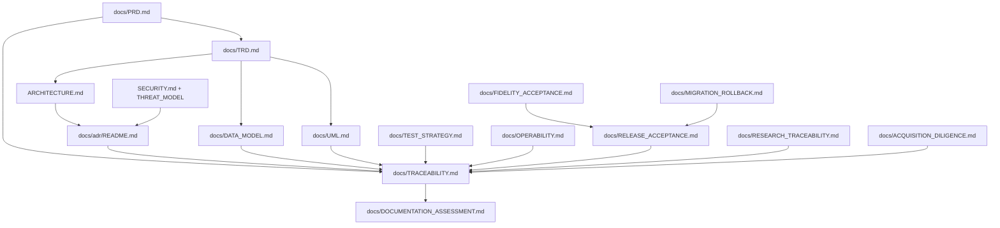

# Clearfolio Requirements and Evidence Traceability

Status: Canonical traceability index
Baseline: protected `main` at `55d7ae8647208e301f282350f076eeddaba61d11`
Assessment date: 2026-08-12

This document maps product and technical requirements to current implementation,
verification, decisions, and open work. It prevents five recurring errors:

1. treating an active pull request as shipped behavior;
2. treating a green check, status, or model comment as independent approval;
3. treating a development placeholder as production Office fidelity;
4. leaving a buyer-visible gap only in issue or PR prose; and
5. trusting predecessor SHAs, reviews, or checks after the source or base moved.

## Maturity and evidence rules

Canonical maturity values are:

- `IMPLEMENTED_ON_MAIN`
- `ACTIVE_PR`
- `PARTIAL`
- `ACCEPTED_ARCHITECTURE`
- `PLANNED`
- `RESEARCH_ONLY`
- `SUPERSEDED`
- `OUT_OF_SCOPE`

A PR-body SHA or run number is narrative. Live GitHub state is authoritative for
the exact source head, independently resolved base, current checks, formal
reviews, unresolved threads, and protected merge policy. `ACTIVE_PR` evidence
never becomes `IMPLEMENTED_ON_MAIN` merely because a branch is mergeable or all
technical checks pass.

## Product requirement traceability

| Requirement | Maturity | Primary implementation or evidence | Verification | Governing authority |
| --- | --- | --- | --- | --- |
| Bounded asynchronous submit | `IMPLEMENTED_ON_MAIN` | `ConversionController`, `DefaultDocumentConversionService`, `DefaultConversionWorker` | controller, service, retry, concurrency, Maven verify | PRD FR-01; TRD §§2, 4, 5 |
| Tenant-scoped job status | `IMPLEMENTED_ON_MAIN` | `TenantAccessService`, status controller, repository ownership checks | authorization, concealment, controller, repository tests | PRD FR-02/FR-06; ADR-0002 |
| Signed viewer artifact delivery | `IMPLEMENTED_ON_MAIN` | `ArtifactLinkService`, `ArtifactController`, issued-token ledger, revocation and range handling | signature, expiry, scope, tenant, document, checksum, range and audit tests | PRD FR-03; ADR-0002; API contract |
| Direct-download signed delivery | `IMPLEMENTED_ON_MAIN` | protected-main #270 direct job download uses tenant permission plus canonical signed artifact-token authority | exact-head CI, authorization, token, range, revocation and read-audit regressions | ADR-0002; API contract; release acceptance |
| Content identity and deduplication | `IMPLEMENTED_ON_MAIN` | conversion service and repository digest identity | service and concurrent repository tests | PRD FR-04; DATA_MODEL `content_identity` |
| Blocked-format and upload bounds | `IMPLEMENTED_ON_MAIN` | validation service and multipart limits | validation, fuzz and multipart tests | PRD FR-05; SECURITY; THREAT_MODEL |
| Privacy-safe HMAC audit pseudonymization | `IMPLEMENTED_ON_MAIN` | protected-main #270 domain-separated, purpose-specific pseudonymous audit evidence | key separation, privacy, no-raw-identifier and no-token regressions | ADR-0003; SECURITY; THREAT_MODEL |
| Privacy-safe public and logged failure envelopes | `IMPLEMENTED_ON_MAIN` | protected-main #270 class-only controlled failure categories and trace identity | provider-controlled message, path, filename, email, stack-trace and raw-job-id regressions | SECURITY; TEST_STRATEGY; OPERABILITY |
| Exact-head CI/test evidence | `IMPLEMENTED_ON_MAIN` | protected-main #270 exact source-head checkout, Maven `verify`, report verification, synthetic-merge separation, coverage and public-Javadoc gates | CI, Maven reports, zero missed owned lines/branches, warning-free public Javadocs | ADR-0007; RELEASE_ACCEPTANCE |
| Strict artifact-token structural parsing | `ACTIVE_PR`; issue #263 security dependency; current #276 | clean current-base token claim boundary preserves trailing empty fields and rejects malformed claims before ledger or authorization access | exact-head CI, Security Scan, SAST, fuzz and focused token tests | ADR-0002; API_CONTRACT; TEST_STRATEGY |
| Production HMAC key readiness | `ACTIVE_PR`; issue #319 dependency; current #313 | clean current-base `ProductionAuthReadinessConfig` rejects missing/null, undersized, normalized, unstable or purpose-reused signing material | exact-head CI, Security Scan, SAST, fuzz and 100% coverage | SECURITY; THREAT_MODEL; MIGRATION_ROLLBACK |
| Runtime credential registry | `PLANNED`; issue #319 | protected main still receives tenant-claim and artifact-token HMAC values from environment-backed Spring configuration; #313 is readiness, not authority migration | registry lookup, rotation, restart, replica, least-privilege and no-secret-log tests required | issue #319; AGENTS; SECURITY; THREAT_MODEL |
| Provider-neutral production identity federation | `PLANNED`; issue #314 | current HMAC-signed gateway claim adapter remains bounded; no complete OIDC/JWT federation is shipped | issuer, audience, algorithm, JWK rotation/outage, tenant mapping and migration tests required | issue #314; PRD; API_CONTRACT; THREAT_MODEL |
| Immutable job identity and durable deletion receipts | `PARTIAL`; issue #263; #268 `SUPERSEDED`; current #345/#350/#351/#353 | the stale broad descendant was closed after its valuable semantics were decomposed into current bounded lanes for permanent job-id reservation, same-job lifecycle serialization, deletion state vocabulary and immutable deletion-receipt identity; durable receipt persistence and recovery are still not shipped | current-base identity/state/locking tests plus future durable replay, crash-tail, fairness, privacy and lifecycle acceptance | ADR-0004; DATA_MODEL; MIGRATION_ROLLBACK |
| User-facing tenant-safe deletion journey | `PLANNED`; issue #263 | lower-layer lifecycle work is not yet an integrated protected-main upload/view/download/delete/recovery workflow | idempotent delete, link invalidation, pending/failure/completion UI, restart/recovery and accessibility tests required | issue #263; PRD; API_CONTRACT; RELEASE_ACCEPTANCE |
| Nested-safe accessible asynchronous controls | `ACTIVE_PR`; current #264 | clean current-base reusable `dom-utils.js` busy-state behavior and a dependency-free Node integration suite preserve nested state, inert repeated activation, focus and restoration semantics | exact-head CI, Security Scan, SAST, fuzz, JavaScript unit/integration and branch-coverage evidence | PRD FR-09; UML viewer flows; issue #263 |
| Viewer render generation safety | `PARTIAL`; issue #322; current `ACTIVE_PR` #323 | clean current-base first slice suppresses stale canvas, metadata, preview-link and ready-state publication after supersession | behavioral Node late-render regression plus exact-head CI/security/SAST/fuzz | issue #322; UML viewer lifecycle; TEST_STRATEGY |
| Active PDF.js task cancellation and destruction | `PLANNED`; issue #322 | #323 discards late results but does not yet complete `RenderTask.cancel()`, loading-task destruction, signed-token parity or multi-generation ownership | cancellation invocation, three-generation, old-success/new-failure, focus/status ownership and no-unhandled-rejection tests required | issue #322; OPERABILITY; TEST_STRATEGY |
| Robust keyboard focus appearance | `PARTIAL`; issue #324; current `ACTIVE_PR` #334 | two independent 3px black/white `:focus-visible` bands reconstructed on protected main | executable CSS geometry and WCAG contrast regression plus exact-head CI/security/SAST/fuzz | issue #324; TEST_STRATEGY |
| Liveness and readiness separation | `ACTIVE_PR`; current #295 | clean current-base `/healthz` process liveness and `/readyz` traffic readiness with controlled no-store payloads | state, failure, recovery, no-cache and missing-authority tests | ADR-0006; OPERABILITY |
| Production workspace and session bootstrap | `PLANNED`; issue #317 | protected main still exposes buyer-demo shell and browser/service demo authority; a real server-controlled bootstrap is absent | production-profile, session authority, real upload/poll/view, tenant isolation and browser-storage tests required | issue #317; PRD; ARCHITECTURE; SECURITY |
| Bounded external-company branding repair | `PARTIAL`; issue #317; current `ACTIVE_PR` #318 | two footer claims change from unrelated HYOSUNG ownership to Clearfolio Apache-2.0 branding | focused root/viewer HTML contract and exact-head CI/security/SAST/fuzz | issue #317; ACQUISITION_DILIGENCE |
| Real Office conversion fidelity | `PLANNED`; issue #5 | protected main has validated PDF passthrough and a development/demo placeholder, not production transformed-format support | authorized realistic Korean/English corpus, security, resource, deterministic rendering, license/SBOM/provenance and recovery gates required | issue #5; ADR-0005; FIDELITY_ACCEPTANCE |
| Provider-neutral Office adapter boundary | `ACTIVE_PR`; issue #5; #306 | Draft adapter and package/output policies remain non-shipped; `docs/UML.md` and `docs/DATA_MODEL.md` model the isolation and conceptual qualification entities | exact-head contract, hostile-package, output-policy, CPU/resource and later runtime-fidelity evidence required | issue #5; #306; ADR-0005; `docs/UML.md`; `docs/DATA_MODEL.md` |
| Durable distributed jobs, backpressure and cancellation | `PLANNED`; issue #312 | protected main still uses process-local job repository, executor and delayed retry timers | atomic accept/outbox, idempotency, lease fencing, redelivery, saturation, cancellation-race, restart and rollback tests required | issue #312; ADR-0004; OPERABILITY; MIGRATION_ROLLBACK |
| Privacy-safe OpenTelemetry | `PLANNED`; issue #312 | selected logs and analytics exist, but no complete trace/metric cardinality and privacy contract | trace correlation, low-cardinality labels, queue/lease/cancellation/recovery metrics and SLO evidence required | issue #312; TRD; OPERABILITY; ACQUISITION_DILIGENCE |
| Complete versioned public API/schema and naruon compatibility | `PARTIAL`; issue #315 | current controllers, records, buyer OpenAPI seed and prose contract do not form one complete released machine-readable authority | route/DTO/error/lifecycle/example/version/breaking-change, standalone and naruon consumer tests required | issue #315; API_CONTRACT; ADR-0001; RELEASE_ACCEPTANCE |
| Buyer OpenAPI license, neutral example and delete-route integrity | `PARTIAL`; issue #315; current `ACTIVE_PR` #316 | bounded integrity slice aligns `info.license` to Apache-2.0, removes demo examples and verifies the required delete path parameter | structured YAML and route contract tests plus exact-head CI/security/SAST/fuzz | issue #315; #316; API_CONTRACT; ACQUISITION_DILIGENCE |
| Stable unique OpenAPI operation identities | `PARTIAL`; issue #315; current `ACTIVE_PR` #337 | offline standard-library checker requires one non-empty unique `operationId` per HTTP operation | positive current-schema test, missing/duplicate/path-metadata regressions and exact-head CI/security/SAST | issue #315; current `ACTIVE_PR` #337; API_CONTRACT |
| Analytics storage-level tenant isolation | `PARTIAL`; issue #326; current `ACTIVE_PR` #342 with stacked #361/#380 | current-base #342 pushes analytics list isolation into a tenant-scoped repository query; #361/#380 extend fail-closed tenant-scoped identifier lookup through repository/service boundaries, while none of these ACTIVE_PR slices is protected-main behavior yet | hostile global-query seam, scoped repository/service interaction and two-tenant concealment/KPI isolation tests | issue #326; ADR-0002; THREAT_MODEL |
| Terminal-outcome conversion success rate | `PARTIAL`; issue #327; current `ACTIVE_PR` #338 | clean current-base KPI response and evidence Javadocs use succeeded divided by succeeded plus failed, excluding in-flight work | mixed terminal/in-flight, zero-terminal, controller and exact-head CI/security/SAST/fuzz tests | issue #327; current `ACTIVE_PR` #338; API_CONTRACT; TEST_STRATEGY |
| Finite and domain-valid persisted KPI evidence | `PARTIAL`; issue #329; current `ACTIVE_PR` #389 | current-base KPI ledger validation rejects NaN, infinities, rates outside `[0,1]` and negative p95 latency without clamping; former #339 is closed historical evidence | invalid replay and valid historical round-trip tests plus exact-head CI/security/SAST/fuzz | issue #329; current `ACTIVE_PR` #389; DATA_MODEL; TEST_STRATEGY |
| Deterministic single logging runtime binding | `ACTIVE_PR`; issue #320; current #340 | clean current-base exclusion keeps Spring `spring-jcl` as the sole Commons Logging bridge and removes standalone `commons-logging` from the PDFBox path | exact-head CI, Security Scan, SAST, fuzz, runtime provider enumeration and dependency-intent contract | issue #320; OPERABILITY; RELEASE_ACCEPTANCE |
| Hourly RCA/feasibility product development | `ACTIVE_PR`; current #271 | clean current-base bounded OpenCode workflow, immutable patch, credential-free verification and Draft-only publication | prompt/workflow contract tests, exact-head CI/security/SAST and protected-main operational run after integration | ADR-0008; ADR-0009; ADR-0011 |
| User-redirection and no-early-stop execution contract | `ACTIVE_PR`; current #271 | actual recurring prompt classifies premature-stop reports, gives prompt repair zero completion credit, rebuilds the live queue, performs same-run substantive work and resets exit sweeps | direct prompt regression and exact-head Buyer-readiness/Maven/merge acceptance | ADR-0009; ADR-0011; hourly operations guide |
| Scheduler execution receipt and resumable continuation | `PLANNED`; issue #331 | external scheduler exposes no durable phase/action/checkpoint evidence; #271 carries only a bounded repository-local semantic slice | run/admission/queue/action/CAS/privacy/failure/budget-continuation simulations and platform evidence required | issue #331; ADR-0012; DATA_MODEL; UML; OPERABILITY |
| Qualifying independent formal review route | `PLANNED`; issue #321; organization `.github#772` ownership | protected merge requires at least one approval from a write-authorized independent reviewer; advisory bots are not counted | eligible human-team provisioning, CODEOWNERS assignment, stale-review and permission-loss acceptance required | issue #321; ADR-0007; ADR-0008; repository metadata |
| Reproducible release, SBOM and provenance | `PARTIAL`; current `ACTIVE_PR` #391 and Draft #392 | #270 integrated deterministic SBOM/attribution and strict source tests; #391 binds buyer OpenAPI bytes to a source revision and #392 proposes a read-only tagged acceptance evidence bundle, but neither is protected-main release truth and no complete protected release has passed integrated fidelity/recovery/review acceptance | release artifact/schema digests, exact tag/source binding, SBOM/license/provenance, rollback and post-publication verification required | ADR-0010; RELEASE_ACCEPTANCE; issue #315 |
| Acquisition, IP and legal diligence | `PARTIAL` | repository license/SBOM/attribution and canonical diligence are inspectable; contributor/IP assignment, FTO, contracts and certification remain external | repository contract tests plus external legal, customer, infrastructure and commercial evidence | ACQUISITION_DILIGENCE; DOCUMENTATION_ASSESSMENT |

## Current clean replacements and superseded predecessors

The following predecessor PRs were closed only after a current-base replacement
was compared by exact blob or semantic patch and independently reverified:

| Requirement lane | Current evidence | Superseded predecessor | Reason |
| --- | --- | --- | --- |
| Focus appearance | issue #324; current `ACTIVE_PR` #334 | #325 `SUPERSEDED` | identical two-file behavior rebuilt on protected main and exact-head checks rerun |
| Terminal KPI denominator | issue #327; current `ACTIVE_PR` #338 | #328 `SUPERSEDED` | all five output blobs are byte-identical on a clean protected-main base |
| KPI ledger numeric validity | issue #329; current `ACTIVE_PR` #389 | #330 `SUPERSEDED`; #339 closed historical evidence | current #389 carries the live bounded invalid-evidence contract; older unmerged heads are not current proof |
| OpenAPI operation identity | issue #315; current `ACTIVE_PR` #337 | #332 `SUPERSEDED` | identical checker/test blobs; predecessor stale ancestry lacked current report verifier |
| HMAC readiness | issue #319; current `ACTIVE_PR` #313 | #333 `SUPERSEDED` | duplicate production blob and equivalent focused tests |
| Availability probes | ADR-0006; current `ACTIVE_PR` #295 | #335 `SUPERSEDED` | duplicate production/test blobs; #295 also retains a scoped operations runbook |
| Branding boundary | issue #317; current `ACTIVE_PR` #318 | #336 `SUPERSEDED` | both changed blobs were byte-identical |
| Broad admin/deletion descendant | issues #263/#312 and bounded current successors #341/#342/#345/#350/#351/#353/#361/#363/#380 | #268 `SUPERSEDED` | 139-file conflict-bearing descendant was closed only after its valuable tenant, identity, lifecycle and audit semantics were mapped to current-base or intentionally stacked bounded lanes; old checks/reviews are non-transferable |

A superseded closure is queue hygiene, not proof that the replacement is shipped.
Each replacement still requires exact-head policy, counted independent approval,
and protected integration.

## Evidence-authority matrix

| Evidence | What it proves | What it does not prove |
| --- | --- | --- |
| Exact-head CI | Deterministic tests and configured quality gates passed for one source identity | Independent approval, future-base compatibility, protected runtime acceptance |
| Synthetic-merge job | Candidate was compatible with the tested base composition | Future live-base compatibility or source-head behavior by itself |
| Security Scan, SAST or fuzz | The configured scanner or target completed successfully on the named identity | Absence of every vulnerability or human approval |
| CodeRabbit, OpenCode, Noema or model comment | Advisory review or model judgment for a named identity | GitHub-counted write-authorized independent approval |
| Formal `APPROVED` review | An eligible reviewer approved a specific review identity subject to policy | Current checks, current base, release or deployment readiness after movement |
| PR-body SHA/run list | Historical narrative and investigation provenance | Live head, base, review, thread or check state |
| Local test output | Developer diagnostic confidence | Protected integration or release evidence |
| Protected-main commit | The merged source is now repository implementation authority | Production deployment, SLO, fidelity, certification or transaction readiness |
| Scheduler activation | A recurrence was enabled or admitted | Queue construction, repository action or successful completion |
| Scheduler execution receipt | The executing control plane reached a named phase and evidence boundary | Current GitHub state, merge authority or an unrecorded hidden root cause |
| `budget continuation` | A run stopped at an observed safe checkpoint before a practical hard boundary | Repository completion or permission to trust checkpoint SHAs as current |
| Fidelity corpus result | Exact runtime satisfied declared fixture assertions | Every customer document, security review or another runtime/corpus |
| SBOM/provenance and artifact digest | Artifact relationship to declared source and materials | Functional correctness, independent approval or legal FTO |
| Repository license and attribution | Source/dependency terms are inspectable | Contributor assignment, patent/trademark FTO, customer data rights or certification |

Any source, base, required-check, review-policy, or reviewer-permission movement
invalidates assumptions not bound to the new exact identity.

## Conversation decision capture

The Clearfolio-scoped decisions repeatedly established in this conversation are
mapped as follows:

- review/check latency never terminates disjoint safe work → ADR-0009;
- blocker → RCA → distinct remedies → feasibility → same-run action → proof → ADR-0009;
- prompt repair earns zero completion credit and user redirection requires same-run substantive execution → ADR-0009, ADR-0011 and current #271;
- two consecutive fresh exit sweeps are required after the last action → ADR-0009 and OPERABILITY;
- central `.github` owns privileged PR maintenance while Clearfolio owns bounded product proposals → ADR-0008;
- OpenCode uses GitHub Secret `NVIDIA_NIM_API_KEY`, not `COPILOT_GITHUB_TOKEN` as a model credential → ADR-0008;
- scheduler prompts are a thin control plane; repository documents are detailed authority → ADR-0011;
- scheduler activation, execution, receipt, controlled failure and continuation are separate evidence classes → ADR-0012 and issue #331;
- signed tenant permission and signed artifact-token byte authority are separate controls → ADR-0002;
- pseudonymized audit identity remains personal data and uses purpose-separated keys → ADR-0003;
- lifecycle identity requires durable generation fencing and truthful cleanup evidence → ADR-0004;
- Office process ownership remains outside the API-container trust boundary → ADR-0005 and issue #5;
- liveness and readiness answer different operational questions → ADR-0006 and current #295;
- PR-body and predecessor checks are not live exact-head/live-base evidence → ADR-0007;
- one integrated protected source/artifact identity owns release truth → ADR-0010;
- documentation sufficiency is an intermediate state, never a stop condition → DOCUMENTATION_ASSESSMENT and ADR-0009;
- acquisition diligence separates repository engineering evidence from external legal, customer and commercial evidence → ACQUISITION_DILIGENCE.

Reports from ThreadWeave, fast-mlsirm, BandScope, TEPP, OriginWeave, LifeOS,
EmbedRelay, MHTML ETL Gateway, or another ContextualWisdomLab repository are not
silently imported into Clearfolio requirements. Only actual Clearfolio runtime,
composition, or organization-control dependencies are referenced here.

## Documentation dependency graph

