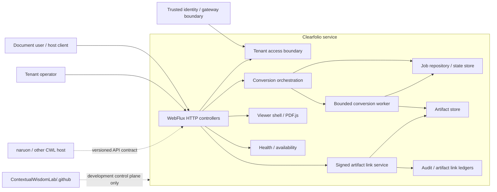
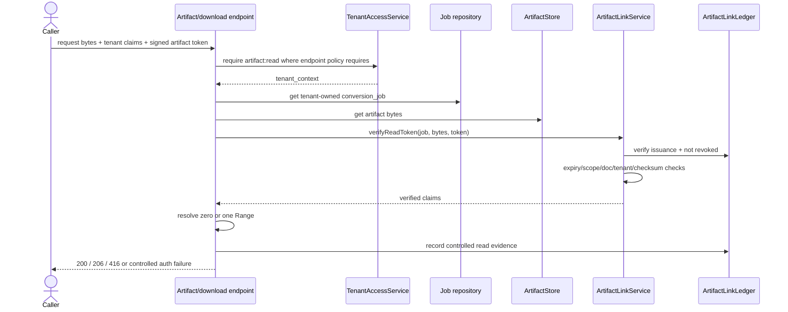
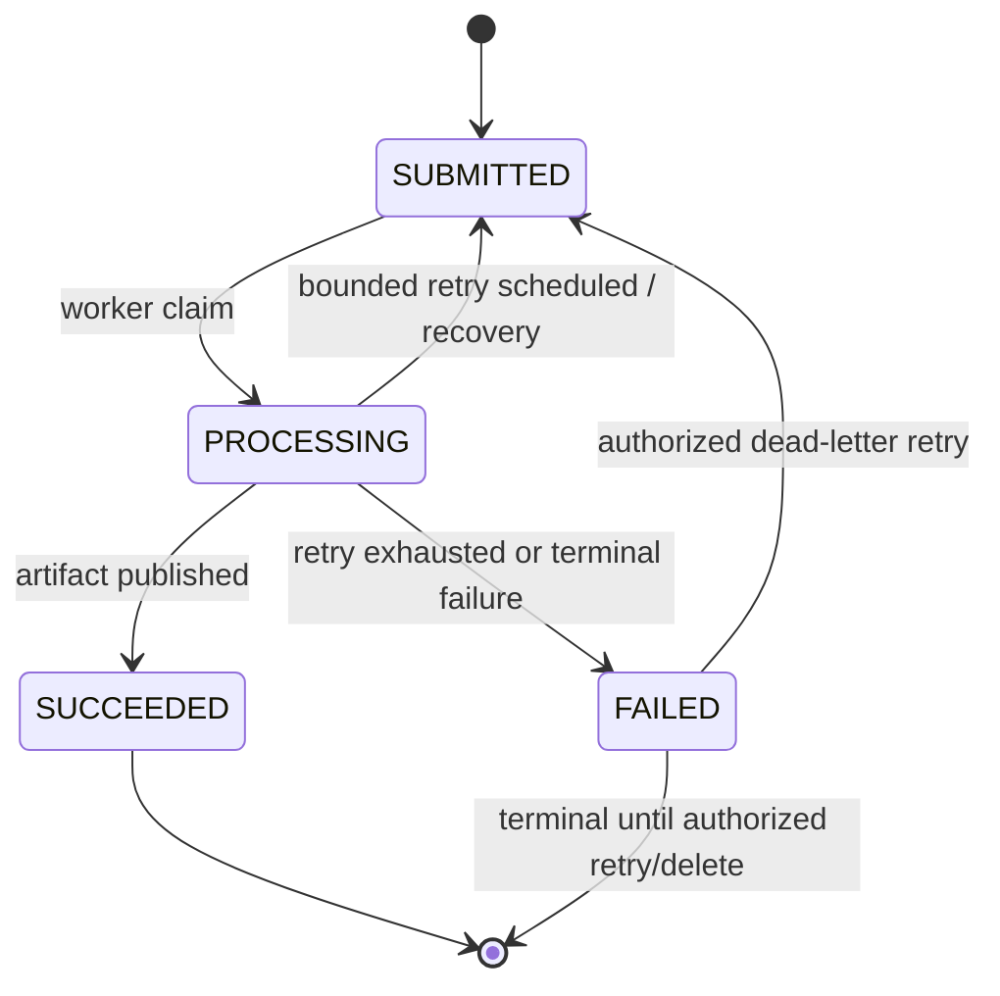
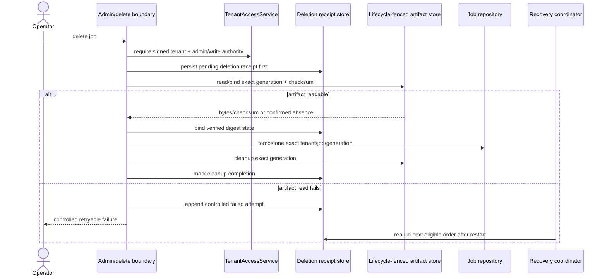
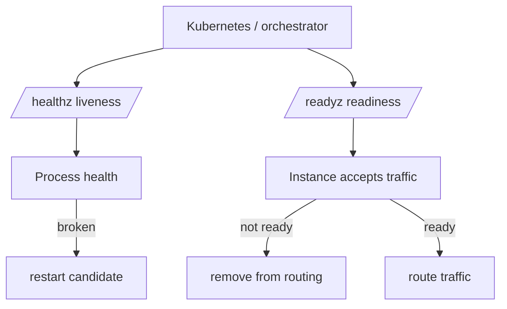
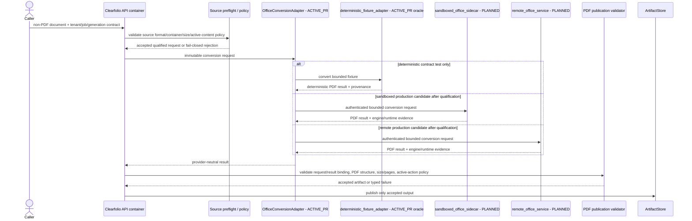
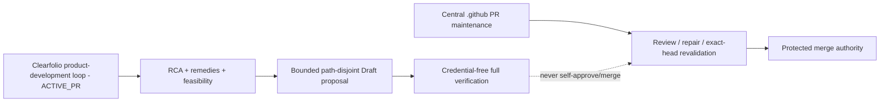
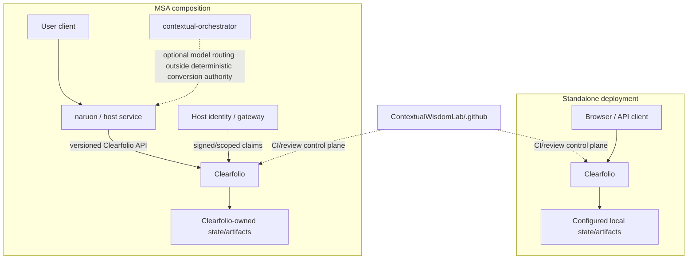
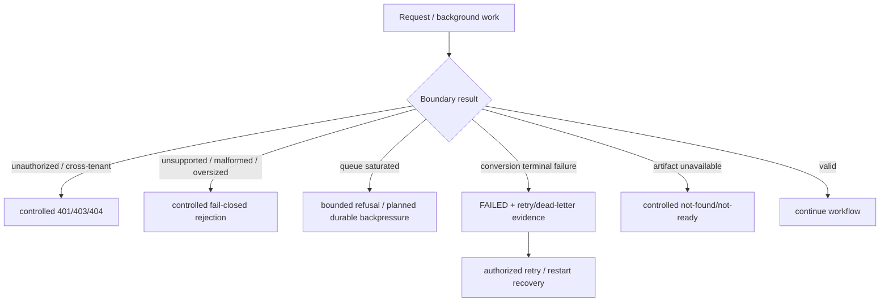
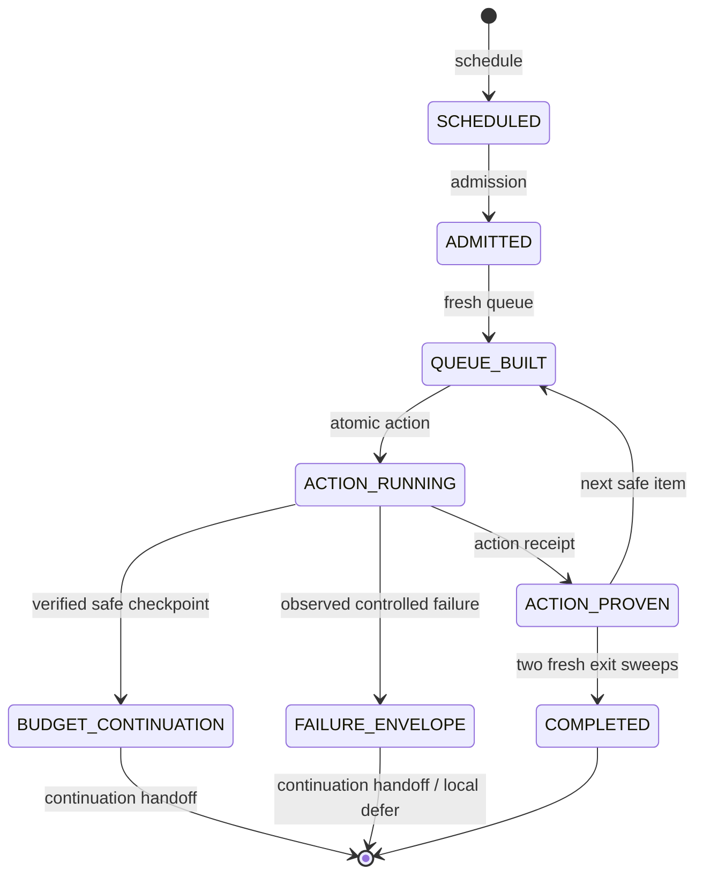

# Clearfolio UML and Architecture Diagrams

Status: Canonical diagram index
Baseline: protected `main` at `83ec6f7fe2b04bdcd28bf98ec350e41e55730a18`

Diagrams are architecture views, not deployment evidence. `ACTIVE_PR` labels identify behavior that is not yet protected-main functionality.

## 1. Bounded-context / component view



## 2. Submit → convert → view sequence

```mermaid
sequenceDiagram
    actor User
    participant API as ConversionController
    participant Auth as TenantAccessService
    participant Service as DocumentConversionService
    participant Repo as ConversionJobRepository
    participant Worker as DefaultConversionWorker
    participant Store as ArtifactStore
    participant Links as ArtifactLinkService
    participant Viewer as Viewer/PDF.js

    User->>API: POST /api/v1/convert/jobs + tenant claims + file
    API->>Auth: require job:create
    Auth-->>API: tenant_context
    API->>Service: submit(file, policy, tenant_context)
    Service->>Service: validate + content identity + dedupe
    Service->>Repo: save conversion_job
    Service->>Worker: enqueue(job)
    API-->>User: 202 + jobId + statusUrl
    Worker->>Store: publish PDF artifact
    Worker->>Repo: mark SUCCEEDED
    User->>API: GET viewer bootstrap
    API->>Auth: require viewer:read + same tenant
    API->>Links: createLink(job, tenant_context)
    Links->>Store: checksum current artifact
    Links-->>API: signed artifact URL
    API-->>Viewer: bootstrap metadata
```

For non-PDF inputs on protected main, artifact generation may be development placeholder behavior; this sequence does not imply Office-fidelity acceptance.

## 3. Tenant-authorized signed artifact read



Protected-main `ArtifactController` already follows this authority pattern. Direct conversion-job download alignment is an `ACTIVE_PR` security remediation and must not be described as complete until integrated.

## 4. Conversion job state machine



Dead-letter exhaustion is represented by `FAILED` plus dead-letter evidence rather than a separate public lifecycle enum.

## 5. Durable deletion recovery (`ACTIVE_PR` #268)



This is target behavior from the active PR, not protected-main evidence.

## 6. Liveness/readiness flow (`ACTIVE_PR` #295)



Shared dependency health must not create restart cascades by contaminating process liveness.

## 7. Office conversion adapter isolation (`ACTIVE_PR` #306 / `PLANNED` issue #5)

PR #306 defines the provider-neutral `OfficeConversionAdapter` contract and deterministic publication-validation boundary as `ACTIVE_PR` evidence. The production Office runtime remains `PLANNED`: a `sandboxed_office_sidecar` or independently operated `remote_office_service` must own Office-process execution **outside the API container**. The `deterministic_fixture_adapter` is an `ACTIVE_PR` offline contract oracle, not a production Office engine. In-process `LocalOfficeManager` inside the Clearfolio API container remains rejected.



The sidecar and remote providers are alternatives, not simultaneous requirements. Their qualification must prove isolation, no inherited application secrets, deny-by-default outbound networking, bounded CPU/RAM/disk/process lifetime, cancellation/restart/cleanup, exact runtime/license/SBOM/provenance, hostile-source handling, and realistic Office fidelity. Neither this diagram nor a successful adapter invocation establishes production Office support; support requires issue #5 release evidence and protected-main integration.

## 8. Automation authority flow



The central control plane and leaf product-development agent are intentionally separate. A local scheduler must not copy central reviewer/merge credentials.

## 9. Standalone and MSA deployment topology



No composition arrow authorizes direct host writes to Clearfolio application persistence.

## 10. Degraded/failure modes



## 11. Scheduler execution receipt and resumable continuation (`PLANNED`; issue #331)

This diagram models the contract from ADR-0012. It does not claim that the external scheduler platform already stores every receipt or that Draft PR #271 is protected-main behavior.

```mermaid
sequenceDiagram
    participant Clock as Schedule
    participant Control as External scheduler / admission
    participant GitHub as Live GitHub authority
    participant Queue as Fresh queue
    participant Writer as Single Clearfolio writer
    participant Receipt as External action receipt store

    Clock->>Control: schedule recurrence
    Control->>Control: admission + run identity
    Control->>GitHub: refetch main, PRs/issues, reviews/checks, blobs/refs, writers
    GitHub-->>Control: exact live evidence
    Control->>Queue: construct fresh queue
    Queue-->>Control: next bounded atomic action
    Control->>Writer: execute exact-head/blob/ref-bound action
    alt action succeeds at stable boundary
        Writer-->>Receipt: action receipt + exact proof
        Receipt-->>Control: next action permitted
        Control->>GitHub: refetch affected state
    else practical budget nearly exhausted
        Writer-->>Receipt: last safe checkpoint
        Receipt-->>Control: budget continuation
        Note over Control,GitHub: Next run must rebuild a fresh queue; checkpoint SHAs are historical
    else observed execution failure
        Writer-->>Receipt: controlled failure envelope + last safe checkpoint
        Receipt-->>Control: continuation handoff or branch-local defer
        Note over Control,Receipt: Generic scheduled-task error remains a symptom; do not invent hidden cause
    end
```

### Receipt state machine



`BUDGET_CONTINUATION` is not product completion. `FAILURE_ENVELOPE` is not a source-code finding or a guessed root cause. The next invocation independently resolves every live GitHub identity before another mutation.

## Related detailed diagrams

Existing dated/feature diagrams remain useful detailed views:

- `docs/diagrams/submit-flow.md`
- `docs/diagrams/submit-policy-adapter-flow.md`
- `docs/diagrams/status-flow.md`
- `docs/diagrams/preview-flow.md`
- `docs/diagrams/retry-deadletter-flow.md`

When a detailed diagram conflicts with this canonical index or protected code, it must be updated or explicitly marked historical.
