# Buyer Demo KPI FigJam Handoff

Date: 2026-07-02

## Figma Artifact

- FigJam: [Clearfolio Buyer Demo Evidence Flow](https://www.figma.com/board/114nJPcTcQzXvAEIS9T4gM?utm_source=codex&utm_content=edit_in_figjam&oai_id=&request_id=41b7cd77-c07e-475e-bd77-460b5911666c)
- Added FigJam diagram on the same board:
  `Clearfolio Threat Boundaries and Data Handling`.
- Added FigJam diagram on the same board:
  `Clearfolio License Diligence Closure Flow`.
- Added FigJam diagram on the same board:
  `Clearfolio Auth Tenant Boundary Flow`.
- Added FigJam diagram on the same board:
  `Clearfolio Operator Job Detail Flow`.
- Added FigJam diagram on the same board:
  `Clearfolio Runtime Tenant Enforcement Flow`.
- Added FigJam diagram on the same board:
  `Clearfolio Gateway Signed Tenant Claims Flow`.
- Added FigJam diagram on the same board:
  `Clearfolio Runtime Signed Artifact Link Flow`.
- Added FigJam diagram on the same board:
  `Clearfolio Artifact Revocation and Read Audit Flow`.
- Added FigJam diagram on the same board:
  `Clearfolio File Backed Artifact Ledger Flow`.
- Added FigJam diagram on the same board:
  `Clearfolio KPI Snapshot Evidence Ledger Flow`.
- Added FigJam diagram on the same board:
  `Clearfolio KPI Snapshot Export Evidence API Flow`.
- Added FigJam diagram on the same board:
  `Clearfolio Buyer Demo KPI Evidence Panel Flow`.
- Added FigJam diagram on the same board:
  `Clearfolio Operator Recovery Evidence Flow`.
- Added FigJam diagram on the same board:
  `Clearfolio Buyer Integration Deployment Flow`.
- Added FigJam diagram on the same board:
  `Clearfolio Durable Job Repository Target Architecture`.
- Added FigJam diagram on the same board:
  `Clearfolio Conversion State Store Implementation Flow`.
- Added FigJam diagram on the same board:
  `Clearfolio Conversion Lifecycle Event Trail Flow`.
- Added FigJam diagram on the same board:
  `Clearfolio Seeded Buyer Demo Story Flow`.
- Added seeded buyer-demo screenshots on the same board:
  desktop node `25:1423`, mobile node `25:1422`.
- Added FigJam diagram on the same board:
  `Clearfolio KRW 2B Buyer Diligence Closure Map`.
- Added FigJam diagram on the same board:
  `Clearfolio Buyer Readiness Scorecard Gate Map`.
- Added FigJam diagram on the same board:
  `Clearfolio Buyer Diligence Slides Storyboard`.
- Added FigJam diagram on the same board:
  `Clearfolio Ready Gate Evidence Integrity Check`.
- Buyer diligence Slides handoff:
  `docs/design/2026-07-03-buyer-diligence-slides-and-closure-map.md`.
- Buyer diligence Slides generation payload:
  `docs/design/2026-07-03-buyer-diligence-slides-generation-payload.json`.
- Figma Code Connect: not used.

## Product Design Acceptance

- The first viewport must show the product name, upload action, and live KPI
  strip without requiring navigation.
- KPI labels must map to buyer-readable outcomes: runtime jobs, ready previews,
  conversion success rate, and p95 preview latency.
- Upload, status tracking, preview handoff, and evidence flow must remain visible
  as one buyer-demo journey rather than separate marketing pages.
- Session history rows must expose a readable job detail drawer before forcing
  buyers or operators into raw JSON.
- The UI must retain keyboard-accessible controls, visible focus, and live status
  announcements for upload and conversion state changes.
- KPI fallback behavior must not create contradictory buyer evidence: backend
  runtime metrics are primary, browser-session history is fallback only.
- KPI snapshot evidence ledger behavior must remain clearly labeled as local
  restart-replay evidence, not as the final durable analytics event store.
- KPI snapshot export lookup must remain tenant-scoped and should not expose
  raw source documents, converted artifacts, signed artifact tokens, or
  cross-tenant identifiers.
- The buyer-demo KPI evidence panel must show export count, latest export time,
  exporting subject, and runtime job count without requiring a raw JSON tab.
- The operator recovery evidence panel must stay scoped to the current browser
  session and should summarize retry posture without claiming production admin
  coverage.
- The seeded buyer-demo story must be labeled as local browser-session demo
  evidence, not production data or a durable analytics source.
- Desktop and mobile screenshot evidence must come from the running local
  product surface after clicking `Load demo story`, not from static mockups.
- Buyer diligence presentation artifacts must keep `Ready`, `Partial`, and gap
  states visually distinct; local seeded proof must not be styled as production
  data.

## Data Analytics Mapping

| UI KPI | API field | Buyer proof |
| --- | --- | --- |
| Runtime jobs | `totalJobs` | Shows observable conversion workload in the current runtime. |
| Ready | `succeededJobs` | Shows previewable documents available for buyer inspection. |
| Success rate | `conversionSuccessRate` | Shows conversion reliability as an acquisition diligence metric. |
| P95 preview | `p95TimeToPreviewMs` | Shows latency evidence for the demo path. |
| Snapshot export | `KpiSnapshotRecord` | Shows when a buyer-visible KPI snapshot was exported under tenant scope. |
| Snapshot evidence lookup | `KpiSnapshotExportResponse` | Lets an authorized buyer inspect exported KPI evidence without raw content. |
| KPI evidence panel | `/api/v1/analytics/kpi-snapshot-exports` | Turns export evidence into a buyer-readable UI panel while omitting tenant ids. |
| Recovery evidence panel | Browser session history plus job status payloads | Shows needs-action jobs, retry-ready dead letters, last accepted retry, and latest inspected detail without a new admin system. |
| Lifecycle event trail | `ConversionJobLifecycleEvent` | Proves ordered transition evidence in the current runtime without storing filenames, content hashes, artifact paths, signed tokens, or raw converter errors. |
| Seeded demo story | `demo-fixtures.json` | Gives screenshots, FigJam, and buyer-deck review one deterministic local story covering success, processing, unsupported-format, dead-letter, KPI snapshot, and KPI export evidence. |
| Buyer diligence closure map | FigJam diagram plus `docs/design/2026-07-03-buyer-diligence-slides-and-closure-map.md` | Aligns Product Design, Data Analytics, Figma, Superpowers, and Ponytail workstreams around current proof, open gaps, and next closure order. |
| Buyer readiness scorecard | `docs/diligence/2026-07-03-buyer-readiness-scorecard.md` plus FigJam scorecard gate map | Quantifies 23 data-room artifacts, 8 readiness gates, and 38 percent conservative gate readiness without hiding partial discount risks. |
| Buyer diligence Slides storyboard | `docs/design/2026-07-03-buyer-diligence-slides-generation-payload.json` plus FigJam storyboard | Makes the 11-slide buyer deck reproducible once Figma team or organization plan selection is available. |
| Ready gate evidence integrity | `scripts/check_buyer_dataroom_manifest.py` plus FigJam integrity check | Prevents a buyer-ready gate from citing partial or external artifacts as complete evidence. |

## Mermaid Source

### Buyer Demo Evidence Flow

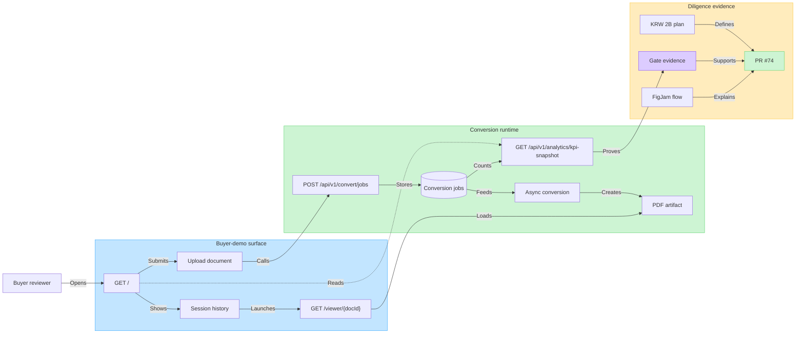

### Buyer Demo KPI Evidence Panel Flow

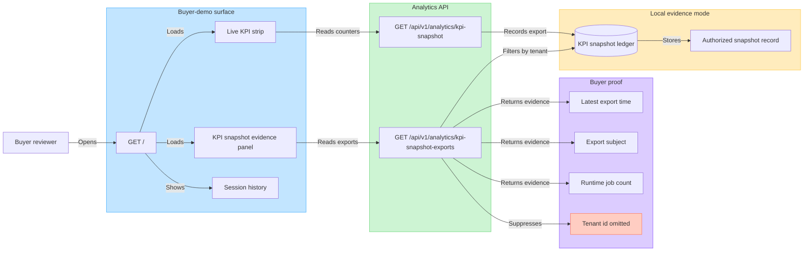

### Seeded Buyer Demo Story Flow

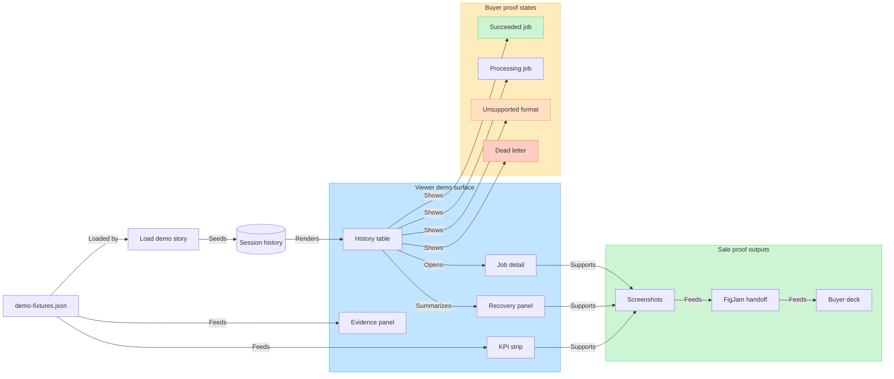

### Operator Recovery Evidence Flow

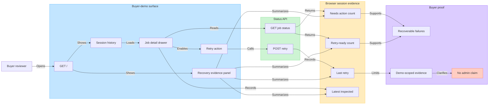

### Buyer Integration Deployment Flow

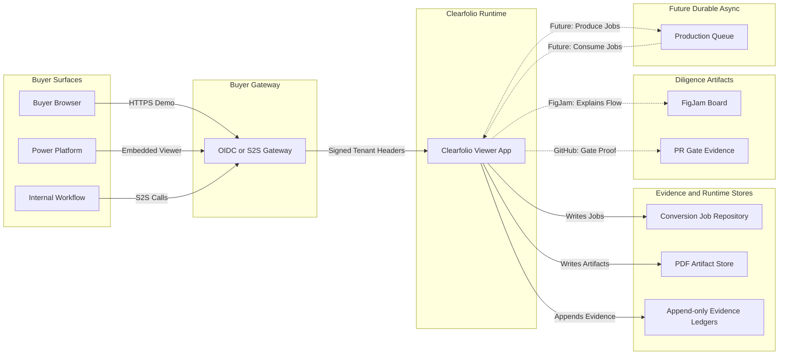

### Durable Job Repository Target Architecture

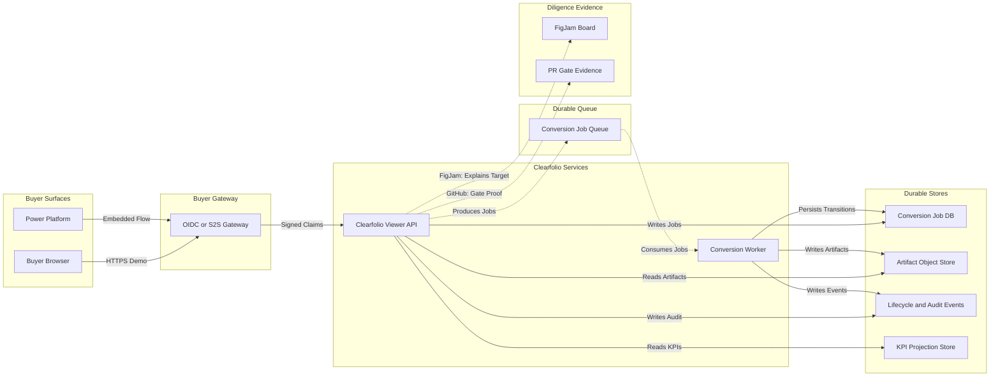

### Conversion State Store Implementation Flow

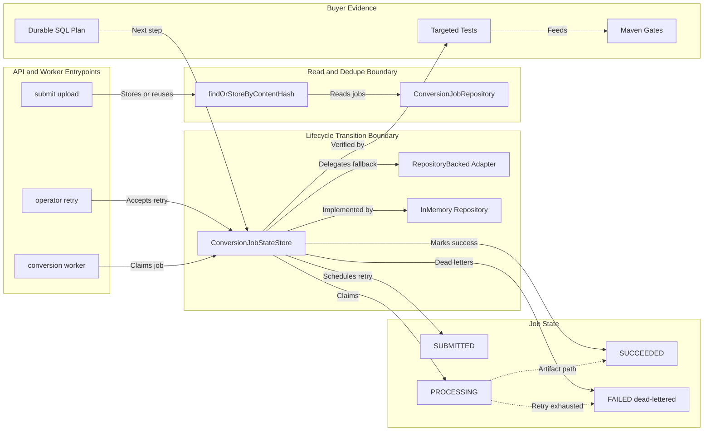

### Conversion Lifecycle Event Trail Flow

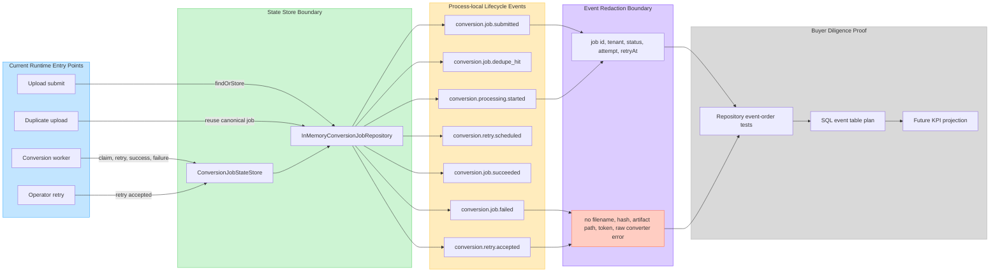

### Threat Boundaries and Data Handling

### License Diligence Closure Flow

```mermaid
flowchart LR
    sbom["CycloneDX SBOM"]
    metadata["License metadata complete"]
    flagged{"Flagged components?"}
    review["Engineering review"]
    legal{"Legal decision"}
    approve["Approve route"]
    attribution["Third-party attribution"]
    replace["Replace dependency"]
    remove["Remove dependency"]
    gate["CI allowlist gate"]
    buyer["Buyer data-room package"]

    sbom -->|"Shows 61 components"| metadata
    metadata -->|"0 unknown"| flagged
    flagged -->|"0 flagged"| review
    review -->|"Classifies risk"| legal
    legal -->|"Allowed"| approve
    legal -->|"Not allowed"| replace
    legal -->|"Not needed"| remove
    approve -->|"Renders notices"| attribution
    attribution -->|"Locks package"| gate
    replace -->|"Rerun SBOM"| sbom
    remove -->|"Rerun SBOM"| sbom
    gate -->|"Prevents drift"| buyer

    style metadata fill:#CDF4D3,stroke:#66D575
    style flagged fill:#FFECBD,stroke:#FFC943
    style legal fill:#FFECBD,stroke:#FFC943
    style replace fill:#FFCDC2,stroke:#FF7556
    style remove fill:#FFCDC2,stroke:#FF7556
    style attribution fill:#C2E5FF,stroke:#3DADFF
    style gate fill:#C2E5FF,stroke:#3DADFF
    style buyer fill:#DCCCFF,stroke:#874FFF
```

### Auth Tenant Boundary Flow

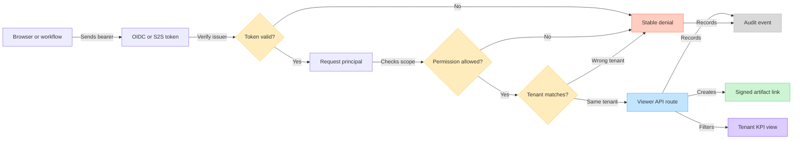

### Gateway Signed Tenant Claims Flow

```mermaid
flowchart LR
    client["Browser or workflow client"]
    gateway["Trusted gateway or host platform"]
    claims["Tenant claim set"]
    signed["Signed X-Clearfolio headers"]
    service["Clearfolio Viewer API"]
    auth["TenantAccessService"]
    tenant["Tenant-scoped job, KPI, viewer, artifact link APIs"]
    reject["401 rejected auth claims"]
    artifact["Signed artifact token"]
    preview["Viewer preview"]
    hidden["404 hidden resource"]
    demo["Unsigned buyer-demo mode only"]

    client -->|"OIDC or platform auth"| gateway
    gateway -->|"Maps identity to tenant id, subject id, permissions"| claims
    claims -->|"HMAC signs tenant id, subject id, permissions, issued-at"| signed
    signed -->|"POST or GET JSON API"| service
    service -->|"Verify signature and skew when configured"| auth
    auth -->|"Valid signature and permission"| tenant
    auth -->|"Missing, stale, future, or invalid signature"| reject
    tenant -->|"Artifact link create"| artifact
    artifact -->|"Tenant and checksum-bound PDF read"| preview
    tenant -->|"Cross-tenant lookup"| hidden
    service -->|"No hmac secret in local demo"| demo

    style gateway fill:#C2E5FF,stroke:#3DADFF
    style service fill:#C2E5FF,stroke:#3DADFF
    style tenant fill:#C2E5FF,stroke:#3DADFF
    style claims fill:#CDF4D3,stroke:#66D575
    style signed fill:#CDF4D3,stroke:#66D575
    style auth fill:#CDF4D3,stroke:#66D575
    style reject fill:#FFCDC2,stroke:#FF7556
    style hidden fill:#FFCDC2,stroke:#FF7556
    style demo fill:#FFCDC2,stroke:#FF7556
```

### Operator Job Detail Flow

```mermaid
flowchart LR
    history["Session history row"]
    details["Details button"]
    statusApi["Status API"]
    drawer["Job detail drawer"]
    deadLetter{"Dead-lettered?"}
    retry["Retry button"]
    retryApi["Retry API"]
    poll["Status polling"]
    viewer["Open viewer"]
    json["Status JSON"]

    history -->|"Selects"| details
    history -->|"Opens"| json
    details -->|"Fetches"| statusApi
    statusApi -->|"Returns evidence"| drawer
    drawer -->|"Shows attempts"| deadLetter
    deadLetter -->|"Yes"| retry
    deadLetter -->|"No"| viewer
    retry -->|"Operator header"| retryApi
    retryApi -->|"Accepted"| poll
    poll -->|"Succeeded"| viewer

    style drawer fill:#C2E5FF,stroke:#3DADFF
    style deadLetter fill:#FFECBD,stroke:#FFC943
    style retry fill:#DCCCFF,stroke:#874FFF
    style retryApi fill:#CDF4D3,stroke:#66D575
    style viewer fill:#CDF4D3,stroke:#66D575
    style json fill:#D9D9D9,stroke:#B3B3B3
```

### Runtime Tenant Enforcement Flow

```mermaid
flowchart LR
    browser["Buyer demo browser"]
    headers["Tenant headers"]
    api["Protected JSON API"]
    auth["TenantAccessService"]
    permission{"Permission present?"}
    repository["Tenant-aware job repository"]
    owner{"Same tenant?"}
    response["Status, viewer, KPI response"]
    denied["401 or 403"]
    hidden["404 hidden resource"]
    artifact["Signed artifact URL"]
    signed["Artifact token verification"]

    browser -->|"Sends"| headers
    headers -->|"Parsed by"| auth
    browser -->|"Calls"| api
    api -->|"Requires"| auth
    auth --> permission
    permission -->|"No"| denied
    permission -->|"Yes"| repository
    repository --> owner
    owner -->|"No"| hidden
    owner -->|"Yes"| response
    response -->|"Returns"| artifact
    artifact -->|"Read guarded by"| signed

    style auth fill:#C2E5FF,stroke:#3DADFF
    style permission fill:#FFECBD,stroke:#FFC943
    style repository fill:#DCCCFF,stroke:#874FFF
    style response fill:#CDF4D3,stroke:#66D575
    style artifact fill:#DFF7E8,stroke:#1B7F3A
    style signed fill:#FFECBD,stroke:#FFC943
```

### Runtime Signed Artifact Link Flow

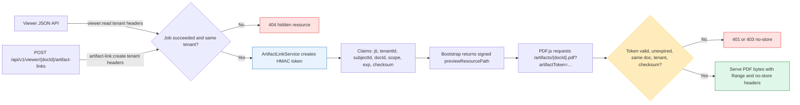

### Artifact Revocation And Read Audit Flow

```mermaid
flowchart LR
    viewer["Viewer or operator"]
    linkApi["POST artifact-links"]
    ledger["Runtime artifact link ledger"]
    artifactApi["GET artifacts doc.pdf"]
    tokenCheck["Token verification"]
    pdfBytes["PDF byte response"]
    audit["Artifact read audit events"]
    operator["Operator or tenant admin"]
    revokeApi["POST artifact-links token revoke"]
    denied["Artifact read blocked"]
    reviewer["Buyer reviewer"]
    auditApi["GET artifact-read-events"]

    viewer -->|"Create signed link"| linkApi
    linkApi -->|"Record token metadata"| ledger
    viewer -->|"Read PDF with artifactToken"| artifactApi
    artifactApi -->|"Verify signature expiry scope doc tenant checksum"| tokenCheck
    tokenCheck -->|"Check token is known and active"| ledger
    ledger -->|"Active token"| artifactApi
    artifactApi -->|"Serve full range or 416"| pdfBytes
    artifactApi -->|"Record status range trace"| audit
    operator -->|"Revoke token"| revokeApi
    revokeApi -->|"Mark token revoked"| ledger
    ledger -->|"Revoked token"| tokenCheck
    tokenCheck -->|"Return 403"| denied
    reviewer -->|"Read audit evidence"| auditApi
    auditApi -->|"Tenant filtered events"| audit

    style linkApi fill:#E8F3FF,stroke:#2F6BFF
    style artifactApi fill:#E8F3FF,stroke:#2F6BFF
    style revokeApi fill:#E8F3FF,stroke:#2F6BFF
    style auditApi fill:#E8F3FF,stroke:#2F6BFF
    style ledger fill:#FFF3E3,stroke:#B95D00
    style audit fill:#FFF3E3,stroke:#B95D00
    style denied fill:#FFE2E2,stroke:#D92D20
```

### File Backed Artifact Ledger Flow

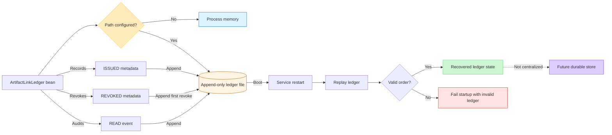

### KPI Snapshot Evidence Ledger Flow

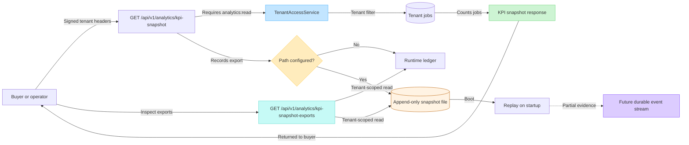

### KPI Snapshot Export Evidence API Flow

```mermaid
flowchart LR
    reviewer["Buyer reviewer"]
    exports["GET /api/v1/analytics/kpi-snapshot-exports"]
    auth["TenantAccessService"]
    ledger["KpiSnapshotLedger"]
    filter{"Same tenant?"}
    response["KpiSnapshotExportResponse"]
    hidden["Excluded export"]
    durable["Future analytics events"]

    reviewer -->|"Signed analytics:read"| exports
    exports -->|"Requires permission"| auth
    auth -->|"Tenant id"| ledger
    ledger -->|"Snapshot records"| filter
    filter -->|"Yes"| response
    filter -->|"No"| hidden
    response -.->|"Temporary read model"| durable

    style auth fill:#C2E5FF,stroke:#3DADFF
    style ledger fill:#FFF3E3,stroke:#B95D00
    style filter fill:#FFECBD,stroke:#FFC943
    style response fill:#CDF4D3,stroke:#66D575
    style hidden fill:#FFCDC2,stroke:#FF7556
    style durable fill:#DCCCFF,stroke:#874FFF
```
