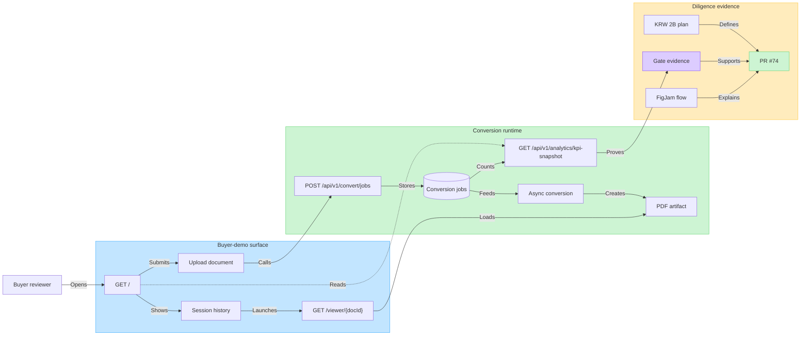

# Buyer Demo KPI FigJam Handoff

Date: 2026-07-02

## Figma Artifact

- FigJam: [Clearfolio Buyer Demo Evidence Flow](https://www.figma.com/board/114nJPcTcQzXvAEIS9T4gM?utm_source=codex&utm_content=edit_in_figjam&oai_id=&request_id=41b7cd77-c07e-475e-bd77-460b5911666c)
- Figma Code Connect: not used.

## Product Design Acceptance

- The first viewport must show the product name, upload action, and live KPI
  strip without requiring navigation.
- KPI labels must map to buyer-readable outcomes: runtime jobs, ready previews,
  conversion success rate, and p95 preview latency.
- Upload, status tracking, preview handoff, and evidence flow must remain visible
  as one buyer-demo journey rather than separate marketing pages.
- The UI must retain keyboard-accessible controls, visible focus, and live status
  announcements for upload and conversion state changes.
- KPI fallback behavior must not create contradictory buyer evidence: backend
  runtime metrics are primary, browser-session history is fallback only.

## Data Analytics Mapping

| UI KPI | API field | Buyer proof |
| --- | --- | --- |
| Runtime jobs | `totalJobs` | Shows observable conversion workload in the current runtime. |
| Ready | `succeededJobs` | Shows previewable documents available for buyer inspection. |
| Success rate | `conversionSuccessRate` | Shows conversion reliability as an acquisition diligence metric. |
| P95 preview | `p95TimeToPreviewMs` | Shows latency evidence for the demo path. |

## Mermaid Source

