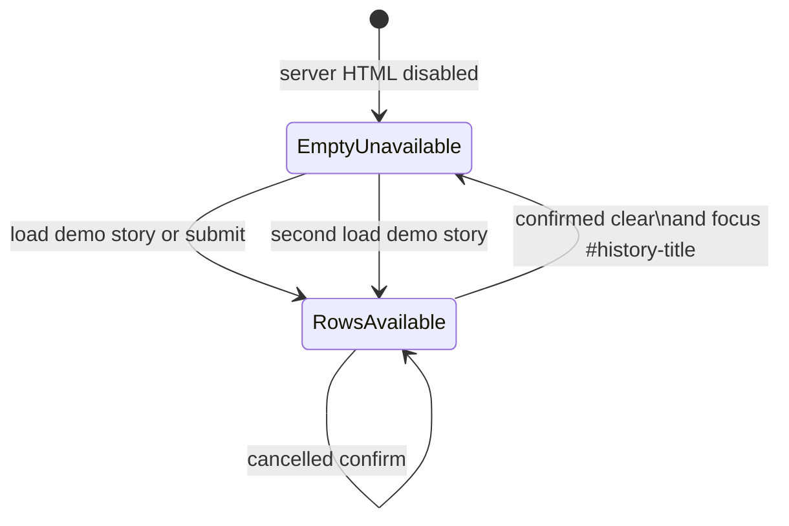

# Doctoring record: session-history clear action availability

## Decision

The buyer-demo session-history clear action is a native button whose
availability follows the same history collection that is rendered in the table.

- The server-rendered empty state starts with the button disabled.
- The visible name is the next-action copy `Clear history`. That string is also
  the accessible name; a second `aria-label` is not maintained.
- Every `renderHistory` call runs `syncClearHistoryAvailability`, which sets
  `disabled` from whether at least one clearable history record exists.
- When a confirmed clear disables the control that still has focus, the script
  moves the caret to the programmatically focusable `#history-title` landmark
  before `disabled` becomes true.
- Loading demo data, adding a session, clearing history, and re-rendering an
  empty state therefore cannot leave stale action availability.

## Buyer impact

Operators no longer see an executable destructive action when there is nothing
to clear. Sighted and assistive-technology users receive the same next-action
name. After a successful clear, keyboard users stay on the Session history
landmark instead of falling to `document.body`.

## Standards and design boundary

HTML defines the native `disabled` state as making a button unavailable for
activation. WAI-ARIA's first rule of use prefers native host-language semantics
when they provide the required behavior; this component therefore uses
`disabled` rather than recreating an unavailable state through `aria-disabled`
and custom event suppression.

The visible name `Clear history` satisfies WCAG 2.2 Success Criterion 2.5.3
Label in Name and Success Criterion 4.1.2 Name, Role, Value without a redundant
ARIA override. Restoring focus to `#history-title` after the control leaves the
tab order follows Success Criterion 2.4.3 Focus Order.

This decision is specific to a permanently unavailable empty-state action. It
does not establish that every temporarily unavailable action should be removed
from the Tab sequence. Controls whose prerequisite explanation must remain
discoverable may require a focusable `aria-disabled` pattern with visible
explanatory text and an explicit inert action boundary.

The change does not claim whole-product WCAG conformance or browser/screen-reader
interoperability. It does not alter the history storage format, retention
policy, tenant authority, conversion jobs, signed links, or production
workspace bootstrap.

## Verification contract

The following assertions are the proof, not surrounding prose:

- `ViewerUiControllerTest.homeReturnsBuyerDemoUploadShell` requires the initial
  document to contain one disabled `Clear history` control, a
  `tabindex="-1"` session-history heading, and no `Clear session history`
  `aria-label`.
- `ViewerUiControllerTest.demoScriptUsesExistingApiAndSessionHistory` locks
  `syncClearHistoryAvailability`, the `clearHistoryBtn.disabled` assignment,
  the active-element comparison, and the `#history-title` landmark lookup.
- `src/test/js/demo-integration.test.mjs`, executed by
  `scripts/test_accessible_async_viewer_controls.py`, runs the shipped script
  and checks: empty history starts disabled; one rendered row enables the
  control; a cancelled confirm leaves availability unchanged; a confirmed clear
  disables the control, reveals `#empty-history`, and moves focus to
  `#history-title`; Load demo story re-enables the control; a second
  load-then-clear cycle cannot leave stale availability.

Exact-head repository CI, fuzzing, Security Scan, and Semgrep remain
authoritative for integration. Predecessor-head results do not transfer after
any commit.

## Rollback

Rollback must remove the initial disabled state, the render-time
synchronization, and the post-clear focus move together. Reverting only one
side would reintroduce stale availability or drop keyboard focus after a
successful clear. Do not restore a compact `Clear` label plus a second
`aria-label` merely to shorten the visible copy.

## References

WHATWG. (2026). *HTML Living Standard: The button element*.
https://html.spec.whatwg.org/multipage/form-elements.html#the-button-element

World Wide Web Consortium. (2023, October 5). *Web Content Accessibility
Guidelines (WCAG) 2.2* (W3C Recommendation). https://www.w3.org/TR/WCAG22/

World Wide Web Consortium. (2023, October 5). *Understanding SC 2.4.3: Focus
Order (Level A)*.
https://www.w3.org/WAI/WCAG22/Understanding/focus-order.html

World Wide Web Consortium. (2023, October 5). *Understanding SC 2.5.3: Label in
Name (Level A)*.
https://www.w3.org/WAI/WCAG22/Understanding/label-in-name.html

World Wide Web Consortium. (2023, October 5). *Understanding SC 4.1.2: Name,
Role, Value (Level A)*.
https://www.w3.org/WAI/WCAG22/Understanding/name-role-value.html

World Wide Web Consortium Web Accessibility Initiative. (2025). *First rule of
ARIA use*. https://www.w3.org/TR/using-aria/#rule1
