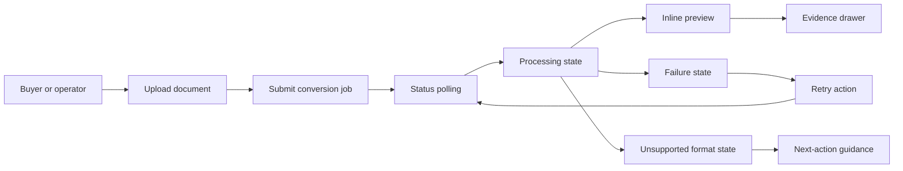
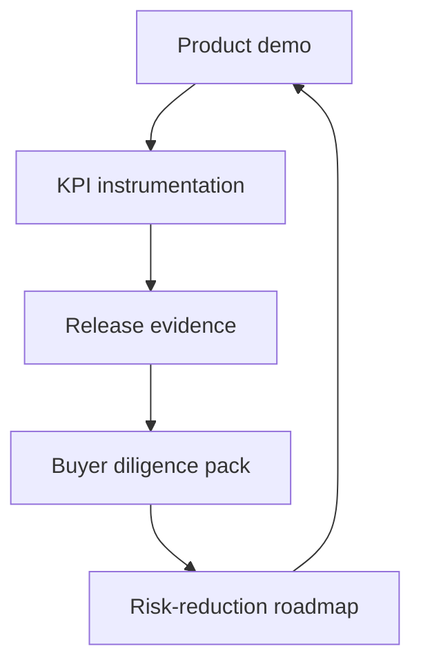

# Clearfolio Viewer KRW 2B Sale-Readiness Execution Plan

Last updated: 2026-07-02

## Goal

Make Clearfolio Viewer demonstrably closer to a KRW 2B acquisition or
licensing-ready product by turning the current MVP into a buyer-demoable,
due-diligence-ready document preview platform package.

This plan uses Product Design, Figma, Data Analytics, Superpowers, and
Ponytail operating principles. Figma Code Connect is explicitly out of scope.

## Current evidence baseline

- Repository product state: Clearfolio Viewer MVP provides asynchronous document
  upload, status polling, viewer bootstrap, PDF preview artifacts, HWP/HWPX
  blocklist behavior, retry and dead-letter flow, and a canonical viewer shell.
- Mandatory engineering gates: warning-free compile, full tests, 100 percent
  JaCoCo line and branch coverage for production package, JavaDoc with no
  warnings or errors, changed-doc Markdown lint, and PR security evidence.
- Current deferred production items: durable database and queue, real converter
  runtime, artifact store, signed links, admin APIs, observability, RBAC, tenant
  isolation, and production security integrations.
- Current buyer gap: the product has a credible conversion/viewer backend, but
  does not yet show a complete buyer demo loop from upload to governed preview,
  operator recovery, analytics proof, and due-diligence evidence.

## KRW 2B sale-readiness bar

Clearfolio should not claim a KRW 2B value from code volume alone. It must show
buyer proof across product, revenue, technology, and operating evidence.

For this program, KRW 2B sale-readiness means the repository can support a
credible acquisition or strategic licensing conversation with the following
evidence:

1. A polished buyer demo that shows upload, conversion progress, preview,
   unsupported-format handling, retry, audit context, and mobile/tablet use.
2. A due-diligence pack with architecture, threat model, security evidence,
   license/SBOM posture, test and coverage evidence, operating runbooks, and
   release evidence.
3. A product analytics model that proves buyer-relevant KPIs: document volume,
   conversion success rate, P95 time to first preview, active tenants, trial to
   paid conversion, retention, support burden, and gross-margin assumptions.
4. A commercial model that connects target ICP, pricing, ARR path, strategic
   integration value, and valuation assumptions.
5. A roadmap whose next engineering steps reduce acquisition risk instead of
   adding speculative features.

## Market and valuation assumptions

The acquisition narrative should be built around enterprise content management,
document management, and AI-assisted document workflow demand.

- Enterprise content management is a large and growing category, with current
  market reports estimating strong demand for cloud deployment, AI-based
  document processing, integration, compliance, and open APIs.
- Document management software is also projected to grow materially through the
  2030s, which supports a focused document-preview wedge when paired with
  enterprise integrations.
- Public and private SaaS revenue multiples vary widely. A practical KRW 2B
  discussion should assume that revenue, growth, retention, integration
  defensibility, and implementation cost will matter more than repository size.
- As a working sale-readiness heuristic, Clearfolio should build proof for a
  path to roughly KRW 400M to KRW 650M ARR at ordinary private SaaS revenue
  multiples, or equivalent strategic value through enterprise integration,
  data-processing defensibility, and low buyer integration cost.

These are planning assumptions, not a valuation opinion. They must be refreshed
with live comparable transactions before investor, lender, or buyer use.

Reference sources for the initial assumptions:

- Bessemer Venture Partners Cloud Index:
  <https://cloudindex.bvp.com/>
- MarketsandMarkets enterprise content management market report:
  <https://www.marketsandmarkets.com/Market-Reports/enterprise-content-management-market-226977096.html>
- Fortune Business Insights document management system market report:
  <https://www.fortunebusinessinsights.com/document-management-system-market-106615>
- Aventis Advisors SaaS valuation multiples report:
  <https://aventis-advisors.com/saas-valuation-multiples/>

## Product Design brief

### User

Enterprise operators and internal platform teams that need secure, low-friction
document preview inside Power Platform, mobile, tablet, or internal workflow
surfaces.

### Core job

Let a user submit a document and reliably preview it without blocking the
request path, while giving operators enough state, evidence, and retry controls
to trust the system in production.

### Demo promise

In under five minutes, a buyer should see:

- a document submitted through an intentional upload surface;
- queued and processing states that feel reliable, not broken;
- inline PDF preview with an artifact link;
- unsupported HWP/HWPX behavior explained without dead-end UX;
- retry or recovery behavior for failed conversions;
- audit-ready state and metadata visible without inspecting raw JSON;
- a mobile/tablet viewport that still works for the same flow.

### Current UX audit findings

- The viewer shell is functional, but it is a late-stage screen. A buyer also
  needs a front door for upload, batch history, and status inspection.
- Status copy is technically accurate but not yet tuned for decision-making.
  Buyer users need "what happened", "what to do next", and "is this safe" cues.
- Operator recovery exists in backend behavior but is not yet visible as an
  admin control surface.
- JSON links are useful for engineers but should be secondary to a readable
  evidence drawer for buyers and operators.
- The visual language is coherent but still MVP-like. A sale demo should be
  quiet, dense, and operational, not marketing-heavy.

## Figma scope

Figma is used for design artifacts only. Figma Code Connect must not be used.

Required Figma deliverables:

1. `Clearfolio Sale-Ready Viewer v1` design file.
2. High-fidelity frames for desktop and mobile:
   - upload and document intake;
   - conversion queue/status;
   - successful preview;
   - unsupported format;
   - failed conversion with retry;
   - operator job detail drawer;
   - due-diligence evidence dashboard.
3. FigJam or diagram frames:
   - buyer demo flow;
   - target architecture;
   - KPI instrumentation flow;
   - phased roadmap to sale readiness.
4. Prototype connections for the happy path and the two negative paths:
   unsupported format and failed conversion.

If Figma MCP creation tools are unavailable in the active environment, this
repository plan remains the source spec and the diagrams below become the
Figma-ready source material. Do not replace this with Figma Code Connect.

## Data Analytics plan

### Buyer KPI model

| KPI | Why a buyer cares | Initial target |
| --- | --- | --- |
| Active tenants | Demand proof | 3 design partners, then 10 paid tenants |
| Documents processed per month | Usage depth | 50K monthly docs after pilot phase |
| Successful preview rate | Reliability | 99.5 percent for supported formats |
| P95 time to first preview | Workflow speed | Less than 10 seconds for small PDFs |
| Unsupported format explanation rate | UX containment | 100 percent explained with next action |
| Retry recovery rate | Operator value | More than 90 percent recoverable failures |
| Trial to paid conversion | Commercial proof | 25 percent or higher for ICP pilots |
| Net revenue retention | Expansion proof | More than 110 percent after paid pilots |
| Gross margin | SaaS quality | More than 75 percent at steady usage |
| Support tickets per 1K docs | Operating burden | Downward trend each release |

### Valuation proof model

The analytics package should maintain three cases:

- Conservative: strategic licensing value with limited ARR, high integration
  evidence, and low support burden.
- Base: KRW 400M to KRW 650M ARR path supported by ordinary private SaaS
  multiples and visible pipeline.
- Upside: stronger multiple from enterprise integration defensibility, data
  processing automation, high retention, and repeatable deployment.

### Instrumentation backlog

- Add first-class metrics for job lifecycle events, conversion duration,
  artifact type, failure category, retry count, tenant, and client surface.
- Add an exportable KPI snapshot endpoint or scheduled report artifact.
- Add seeded demo data so Figma, local demo, and buyer deck use the same story.
- Add evidence snapshots under `docs/qa/evidence/` for each release candidate.

Progress as of 2026-07-02:

- `GET /api/v1/analytics/kpi-snapshot` now exports current runtime counters
  for total, submitted, processing, succeeded, failed, dead-lettered,
  conversion success rate, and p95 time-to-preview. This is intentionally
  scoped to current in-memory runtime data until durable persistence exists.
- The buyer-demo root shell now consumes that KPI endpoint directly and falls
  back to browser-session history only when the runtime snapshot is unavailable.
- Figma evidence flow is now captured as a FigJam artifact and mirrored in
  `docs/design/2026-07-02-buyer-demo-kpi-figjam-handoff.md`.
- Market, valuation, pricing, and KPI thresholds are now captured in
  `docs/business/2026-07-02-krw2b-valuation-kpi-model.md`.
- Buyer diligence questions, current evidence, gaps, and next closure artifacts
  are now indexed in `docs/diligence/2026-07-02-buyer-diligence-index.md`.
- Threat model, trust boundaries, data handling, and retention classification
  are now captured in
  `docs/security/2026-07-02-threat-model-data-handling.md`.
- CycloneDX SBOM evidence is now generated under
  `docs/qa/evidence/2026-07-02-krw2b-sale-readiness/`.
- Engineering license allowlist review is now captured in
  `docs/security/2026-07-02-license-allowlist-review.md`; legal clearance
  remains open for 6 flagged components.
- Signed artifact link runtime is now implemented for current in-memory PDF
  artifacts and captured in
  `docs/security/2026-07-02-signed-artifact-link-design.md`.
- Auth, RBAC, and tenant model design is now captured in
  `docs/security/2026-07-02-auth-tenant-model.md`; the first runtime slice now
  enforces tenant headers and permissions on JSON APIs, stores job tenant
  metadata, filters KPI snapshots by tenant, and hides cross-tenant jobs.
  Signed artifact tokens are now enforced for artifact reads. Validated
  OIDC/JWT claims, role mapping, durable revocation, and audit persistence
  remain open.
- Durable metrics event model is now captured in
  `docs/analytics/2026-07-02-durable-metrics-event-model.md`.

## Library and submodule decision

Do not split a separate library or Git submodule in the first sale-readiness
slice.

Rationale:

- The repository currently has one real runtime and no second consumer that
  would justify independent versioning.
- A Git submodule would increase buyer diligence complexity without improving
  the demo or operating evidence.
- The next clean step is an in-repository boundary: keep controller, service,
  model, repository, artifact, and future adapter packages cohesive.
- Consider a Maven multi-module split only when converter adapters, analytics
  contracts, or SDK clients have independent tests, release cadence, and a real
  consuming app.
- Consider a separate repository only when a buyer or partner needs a stable
  public SDK or shared converter contract.

## Execution roadmap

### Phase 1: Buyer-demo shell

Deliver a complete buyer demo surface without changing the production contract.

- Add an upload and document history front door.
- Add clear status states for submitted, processing, succeeded, failed, and
  unsupported documents.
- Add operator-readable evidence drawer content before adding an admin system.
- Add seeded demo fixtures and screenshots for desktop and mobile.
- Preserve the existing API and Maven gates.

Progress as of 2026-07-02:

- `GET /` now serves the buyer-demo document intake shell.
- The shell posts to the existing `/api/v1/convert/jobs` endpoint, tracks
  session history in browser-local storage, polls existing status URLs, and
  links each job to `/viewer/{docId}`.
- The shell includes session KPIs for submitted, ready, and needs-action
  documents, providing the first product-facing anchor for the Data Analytics
  KPI model.
- Session history rows now expose a job detail drawer backed by the existing
  status API, including attempts, retry schedule, dead-letter state, artifact
  path, and an operator retry action for dead-lettered jobs.
- Demo JS now sends `buyer-demo` tenant headers to protected JSON APIs, and the
  viewer shell no longer reveals job existence before the protected status API
  decides state.
- Viewer bootstrap now returns a short-lived signed artifact URL, and direct
  artifact reads require an `artifactToken` query parameter or bearer token.

### Phase 2: Due-diligence pack

Make the repo easy to inspect by a buyer, reviewer, or security team.

- Add sale-readiness PRD and roadmap.
- Add threat model and data handling map.
- Add license/SBOM evidence.
- Add release evidence template and update `docs/qa/evidence/LATEST.md`.
- Add SAST/code-scanning evidence to each PR.

### Phase 3: Production risk reduction

Replace MVP internals that buyers will discount.

- Add durable job repository and migration strategy.
- Add real artifact store abstraction.
- Replace demo tenant headers with validated OIDC/S2S claims and role mapping.
- Add durable artifact metadata, token revocation, and artifact read audit
  events.
- Add metrics and observability.
- Add converter runtime integration behind a stable adapter boundary.

### Phase 4: Commercial proof

Prepare acquisition/licensing package evidence.

- Add KPI reporting and demo dashboard.
- Add pricing and ICP assumptions.
- Add buyer diligence index.
- Add deployment and integration playbook for Power Platform and mobile/tablet.
- Add partner/customer pilot evidence when available.

## Immediate autonomous PR sequence

1. PR A: add this sale-readiness plan and align docs with the KRW 2B bar.
2. PR B: implement buyer-demo upload/history shell in the existing static UI
   style, without adding a new frontend framework.
3. PR C: add metrics model and KPI snapshot documentation or endpoint.
4. PR D: add due-diligence checklist, threat model, and security evidence
   template.
5. PR E: add artifact store and signed-link design or implementation slice.

Review waiting time is not a blocker. Each PR should continue through normal
checks and merge flow when branch policy allows it.

## Figma-ready diagrams

### Buyer demo flow

### Sale-readiness evidence loop

## Acceptance checks for this plan

- The plan defines the KRW 2B sale-readiness bar in product, design, data,
  diligence, and engineering terms.
- Figma is scoped to design, prototype, and diagram work only.
- Figma Code Connect is explicitly excluded.
- Product Design output is grounded in the current viewer shell and repo docs.
- Data Analytics output defines buyer KPIs and valuation proof assumptions.
- Ponytail decision avoids premature library or submodule split.
- Next implementation PRs are ordered by buyer value and diligence risk.
- Existing AGENTS.md gates remain unchanged.
