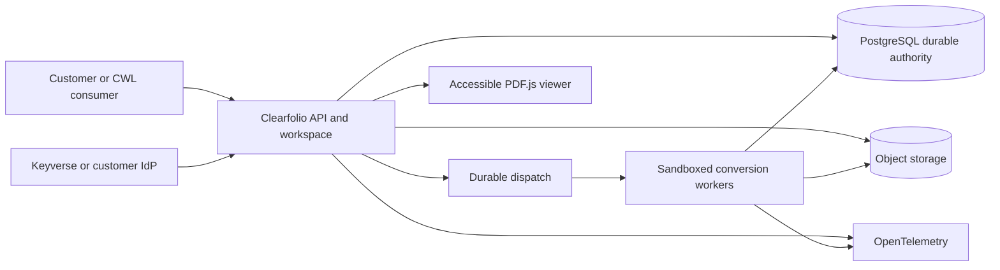

# Clearfolio Product and Technical Gap Baseline

**Baseline version:** 0.1  
**Status:** Proposed  
**Coordination authority:** [Issue #484](https://github.com/ContextualWisdomLab/clearfolio/issues/484)  
**Snapshot time:** 2026-08-20 22:00 KST  
**Protected source snapshot:** `main@06633a25109c62e24a7015ae04fb9f6e0a246f7e`

## 1. Purpose

This document is the canonical, buyer-oriented baseline for deciding whether
Clearfolio is complete, releaseable, and supportable. It records:

- what protected `main` actually ships;
- what exists only in an active pull request;
- which product and technical gaps still block a commercial release;
- which existing issue or pull request owns each gap;
- what evidence is required before a gap can be closed;
- how the live pull-request queue must converge instead of continuing to
  accumulate overlapping micro-slices.

This baseline is not a valuation claim, certification claim, release note, or
substitute for exact-head verification. A design, issue, pull-request body,
generated value object, passing predecessor workflow, or demo screenshot is not
shipped behavior.

## 2. Evidence vocabulary

Every capability and gap in this document uses one state.

| State | Meaning |
|---|---|
| `SHIPPED_ON_MAIN` | Behavior and its current exact-main evidence are on protected `main`. |
| `ACTIVE_PR` | A live pull request contains relevant work, but the behavior is not protected-main authority. |
| `OPEN_GAP` | Required behavior has no complete current implementation. |
| `EXTERNAL_BLOCKER` | Completion depends on an organization control, independent review, licensed runtime, external infrastructure, or other repository. |
| `SUPERSEDED` | A newer candidate owns the semantic delta; the older candidate must not be merged. |
| `NOT_APPLICABLE` | The capability is deliberately outside Clearfolio's responsibility boundary. |

A state may advance only when the evidence changes. Documentation must never
promote an `ACTIVE_PR` to `SHIPPED_ON_MAIN` merely because checks passed on a
branch.

## 3. Product boundary

### 3.1 Clearfolio owns

Clearfolio is a document-preview and controlled conversion runtime. Its durable
product responsibility is to:

1. accept an authorized document submission;
2. identify and validate the source format without trusting filename or
   client-supplied MIME type;
3. execute a bounded asynchronous preview/conversion job;
4. publish a versioned, integrity-bound preview artifact;
5. provide an accessible browser viewer and controlled download;
6. preserve tenant, policy, lifecycle, audit, and provenance evidence;
7. run standalone and as a versioned module/API for CWL consumers such as
   naruon or Orgmetra without direct database coupling.

### 3.2 Clearfolio does not own

Clearfolio is not the system of record for:

- mailbox, calendar, or source-file authority;
- HR candidate or employee records;
- document authoring and collaborative editing;
- semantic document extraction or knowledge-graph truth;
- enterprise identity credentials;
- billing, subscription, or entitlement truth.

Those remain with their owning CWL products or customer systems. Clearfolio may
consume opaque identity, source, entitlement, and retention references through
versioned contracts.

## 4. Current protected-main snapshot

### 4.1 Live queue

At the snapshot time, GitHub reported:

| Inventory | Count |
|---|---:|
| Open pull requests | 85 |
| Draft pull requests | 25 |
| Pull requests targeting `main` | 76 |
| Stacked or non-`main`-base pull requests | 9 |
| Open issues before coordination issue #484 | 18 |

The raw number of open changes is not progress evidence. The queue contains
parallel replacements, stacked children, value-type-only foundations,
reconstructed current-main successors, and automatically generated candidates
that overlap the same production boundary.

### 4.2 Shipped truth observed on protected `main`

The repository currently presents an MVP with a strong engineering test
substrate, but not a GA product.

| Area | Protected-main truth | State |
|---|---|---|
| Runtime | Java 21 Spring WebFlux application with repository-wide Maven verification. | `SHIPPED_ON_MAIN` |
| Quality policy | Zero test skips/failures, 100% owned-package JaCoCo statement/line/branch coverage, strict public Javadocs, security/SAST/fuzz gates are documented repository policy. | `SHIPPED_ON_MAIN` |
| Product shell | Root experience is still a buyer-demo shell with synthetic story/KPI/recovery evidence. | `SHIPPED_ON_MAIN` |
| Identity | Tenant header/HMAC scaffold exists; production OIDC/JWT federation is not complete. | `OPEN_GAP` |
| Jobs | Default accepted-job authority is process-local and does not prove restart/multi-instance durability. | `OPEN_GAP` |
| Artifacts and analytics | Single-process file-backed ledgers exist, but not a transactional multi-instance system of record. | `OPEN_GAP` |
| Viewer | PDF.js preview is the currently qualified renderer path. | `SHIPPED_ON_MAIN` |
| Office formats | Office adapter contract work exists, but no production-qualified converter/fidelity claim is shipped. | `ACTIVE_PR` |
| API | A buyer OpenAPI exists, but complete route/schema/version/client/release parity remains open. | `OPEN_GAP` |
| SLO | Availability and latency numbers in product documents are targets, not measured tagged-release evidence. | `OPEN_GAP` |
| Release | A complete tagged GA release with integrated SBOM, provenance, restore, rollback, support, and format-fidelity evidence is not published. | `OPEN_GAP` |

## 5. Current pull-request inventory

The following list contains every open PR observed at the snapshot time. It is
grouped by primary responsibility, not by merge order. Exact head, base, draft,
check, review, and thread state must be re-fetched before any action.

| Workstream | Open PRs at snapshot |
|---|---|
| Governance, canonical documentation, workflow audit, release provenance | #271, #305, #424, #426, #427 |
| Office conversion contract | #306 |
| Product/demo/profile, viewer, accessibility, and interaction | #323, #334, #378, #417, #445, #459, #465, #466, #472, #473, #477, #481 |
| Versioned API and compatibility | #337, #379, #381 |
| Identity, tenant authority, credential source, artifact security, and administration | #313, #343, #344, #348, #352, #354, #356, #374, #375, #408, #409, #413, #414, #415, #418, #430, #431, #433, #434, #438, #455, #463, #469, #470, #475, #478, #479, #480, #482, #483 |
| Durable execution, lifecycle, artifact integrity, and worker state | #351, #353, #366, #367, #368, #369, #370, #371, #373, #376, #377, #410, #412, #416, #422, #428, #429, #439, #443, #448, #449, #450, #451, #457 |
| Analytics, observability, and tenant-safe query semantics | #385, #432, #437, #456 |
| Operations and shared test reliability | #454, #458 |
| Logging runtime integrity | #411 |
| Speculative token-parser performance work | #462, #468, #474 |

### 5.1 Immediate convergence groups

These groups cannot all remain independent merge candidates.

| Semantic boundary | Candidates | Required disposition |
|---|---|---|
| Runtime secret/configtree migration | #463, #470, #479, #482, #483, plus ordered registry stack #344 → #354 → #433 | Identify the one complete, current-main landing path. Preserve unique tests, close duplicate generated branches, and keep credential-registry/KMS work distinct from deleting an environment fallback. |
| AdminController authorization and tenant isolation | #455, #469, #475, #478, #480 | Compare exact diffs and tests; retain the candidate that preserves tenant-scoped storage/service boundaries and authenticated audit identity. Close narrower or contradictory duplicates. |
| Token parser optimization | #462, #468, #474 | Do not merge a manual parser based on assertions. Follow benchmark-first issue #444 with bounded hostile corpora and behavioral equivalence. |
| Tenant-scoped analytics | #432, #456 | Select the current protected-base candidate and supersede the other after preserving any unique evidence. |
| Credential stack | #344 → #354 → #433 | Keep dependency order explicit; children remain non-merge-ready until their parent reaches protected `main` and they are rebuilt/revalidated. |
| PDF.js generation and active cancellation | #323 → #445 | Land generation ownership first; rebuild the active-cancellation delta on protected `main`. |
| Artifact ledger integrity stack | #457 → #448 → #449 → #450 | Reconstruct each child in order after the parent lands; historical stacked checks are not main-targeted release evidence. |
| Analytics reservation/lookup stack | #432 → #443 → #451 | Reconcile with the independent current-main admin-security lane after ancestors integrate. |

## 6. Product and technical gap matrix

### GAP-001 — Pull-request queue cannot converge to a release

- **Priority:** P0
- **State:** `OPEN_GAP`
- **Buyer impact:** No stable release candidate can emerge while duplicate and
  predecessor branches compete for the same paths and approval.
- **Current evidence:** 85 open PRs, including multiple secret, admin,
  analytics, parser, ledger, and current-main reconstruction families.
- **Owning authority:** issue #484; reviewer-route issue #321; workflow-registry
  issue #423 and PR #424.
- **Completion evidence:**
  - every open PR has one queue class;
  - all duplicate/superseded PRs are closed with a reason;
  - every stack has one explicit parent and reconstruction order;
  - no two ready PRs own the same semantic/path boundary;
  - current-head checks, zero valid unresolved threads, and qualifying
    independent approval exist for each merge candidate;
  - the queue is re-enumerated after every merge.

### GAP-002 — Buyer-demo authority is still the primary product experience

- **Priority:** P1
- **State:** `OPEN_GAP`
- **Buyer impact:** A customer cannot onboard, submit, inspect, recover, or
  administer real tenant documents through a production workspace without
  demo authority leaking into the product model.
- **Existing authority:** issue #317; PRs #378, #459, #465 and related viewer
  work.
- **Completion evidence:**
  - production root routes to a tenant-aware workspace;
  - demo content is available only from a mutually exclusive demo/test profile;
  - upload, progress, preview, retry, cancellation, download, deletion, and
    audit journeys are complete;
  - empty, partial, degraded, denied, and recovery states provide the next
    customer action;
  - no hard-coded tenant, subject, filename, token, KPI, or document data is
    production authority.

### GAP-003 — No complete production identity and authorization chain

- **Priority:** P1
- **State:** `OPEN_GAP`
- **Buyer impact:** Header/HMAC scaffolding and isolated value objects do not
  prove federated identity, rotation, revocation, tenant mapping, or regulated
  administrative access.
- **Existing authority:** issues #314 and #319; PRs #313, #343, #344, #354,
  #374, #375, #408, #433, #455 and overlapping generated admin/security PRs.
- **Completion evidence:**
  - OpenID Connect discovery or configured issuer trust;
  - strict issuer, audience, signature algorithm, key ID/generation, expiry,
    clock-skew, and nonce/replay policy;
  - server-owned tenant and role mapping;
  - OAuth 2.0 Security BCP and JWT BCP negative tests;
  - provider-neutral KV/KMS registry with purpose-separated keys, compatibility
    windows, restart/replica behavior, least privilege, and rotation rehearsal;
  - artifact, analytics, and admin authorization is storage-scoped and
    fail-closed;
  - raw secrets and identity claims never enter logs, telemetry, PR fixtures,
    browser code, or error messages.

### GAP-004 — Accepted jobs are not a durable distributed workflow

- **Priority:** P1
- **State:** `OPEN_GAP`
- **Buyer impact:** Restart, duplicate delivery, stale workers, saturation, and
  cancellation races can lose or duplicate work without an integrated durable
  authority.
- **Existing authority:** issue #312; PRs #366–#373, #376, #377, #412, #416,
  #422, #428, #429, #439, #443, #451, plus test repair #454.
- **Completion evidence:**
  - PostgreSQL-backed 3NF job, generation, attempt, lease, retry, dead-letter,
    inbox, outbox, idempotency, cancellation, and audit records;
  - job acceptance and outbox publication in one transaction;
  - at-least-once delivery with idempotent inbox receipt;
  - worker lease claim/renew/expiry and stale-publication fencing;
  - bounded queue admission with `429` or `503` and actionable retry guidance;
  - durable cancellation and deterministic completion race winner;
  - multi-instance, crash, restart, duplicate, delayed, reordered, and
    partitioned-delivery integration tests;
  - hot-partition-aware primary keys/indexes and measured capacity.

### GAP-005 — Artifact lifecycle is single-process and incomplete

- **Priority:** P1
- **State:** `OPEN_GAP`
- **Buyer impact:** Customers need proof that preview bytes, metadata, links,
  reads, revocations, retention, and deletion remain consistent across failure
  and recovery.
- **Existing authority:** issue #263; PRs #351, #353, #410, #413, #415, #418,
  #431, #439, #457 → #448 → #449 → #450.
- **Completion evidence:**
  - object-store-backed immutable artifact versions with checksum and policy
    identity;
  - atomic metadata and publication authority;
  - tenant- and document-bound short-lived read capability;
  - durable issue/read/revoke audit and replay validation;
  - retention hold, tombstone, physical cleanup, retry, terminal receipt, and
    restoration behavior;
  - range/download/cache/security-header semantics;
  - concurrent read/revoke/delete, partial write, stale generation, restart,
    and cross-instance tests;
  - customer-visible deletion and recovery state.

### GAP-006 — Office support is not production-qualified

- **Priority:** P1
- **State:** `ACTIVE_PR`
- **Buyer impact:** Resume, certificate, portfolio, spreadsheet, and slide
  customers cannot rely on advertised support without sandbox and fidelity
  evidence.
- **Existing authority:** issue #5 and draft PR #306.
- **Completion evidence:**
  - converter executes outside the API process in a sandboxed sidecar or
    authenticated remote trust boundary;
  - no macro execution, external fetch, unsafe embedded object, or inherited
    tenant credential;
  - allowlisted extension, detected MIME/signature, bounded archive expansion,
    active-content checks, and malware/quarantine policy;
  - CPU, RAM, file, page, process, queue, network, and wall-clock limits;
  - deterministic adapter/policy/runtime/license/SBOM/provenance identity;
  - authorized Korean/English DOCX, XLSX, and PPTX corpus covering fonts,
    tables, charts, pagination, formula display, images, notes, RTL/CJK where
    supported, and malformed hostile fixtures;
  - declared fidelity metrics and reviewable visual/structural diff thresholds;
  - explicit unsupported and degraded outcomes;
  - transformed PDF passes viewer security and accessibility validation.

### GAP-007 — Viewer async ownership and accessibility are incomplete

- **Priority:** P1
- **State:** `ACTIVE_PR`
- **Buyer impact:** A stale render or inaccessible control can show the wrong
  document state or prevent keyboard/screen-reader users from completing the
  workflow.
- **Existing authority:** issues #322, #324, and #476; PRs #323, #334, #445,
  #465, #466, #472, #473, #477, #481.
- **Completion evidence:**
  - one generation/attempt owns each DOM publication;
  - superseded loading and render tasks are actively cancelled/destroyed;
  - no stale canvas, link, metadata, status, or focus publication;
  - no unhandled cancellation rejection;
  - every state is independently renderable and testable in Storybook;
  - keyboard, focus-visible, busy/disabled, live-region, forced-colors,
    reduced-motion, responsive, and representative screen-reader tests pass;
  - WCAG 2.2 AA is the product target, with exact-value/text alternatives;
  - existing Figma file `UPIMvnjyP1sTXhIy1wqD02` and Storybook use the same
    component/state vocabulary; the design ADR records the Figma file ID and
    runtime token authority.

### GAP-008 — API and ecosystem contract is not a release artifact

- **Priority:** P2
- **State:** `ACTIVE_PR`
- **Buyer impact:** Standalone and CWL consumers cannot safely generate clients,
  upgrade, or detect breaking changes from partial contract checks.
- **Existing authority:** issue #315; PRs #337, #379, #381, #426, #409.
- **Completion evidence:**
  - route, method, security, parameter, DTO, schema, response, and error parity;
  - stable unique `operationId` values;
  - explicit contract version/deprecation policy;
  - deterministic breaking-change gate against a tagged baseline;
  - generated clients exercised against a running service;
  - idempotency, pagination, rate-limit, retry, range, and problem-detail
    semantics;
  - standalone and naruon adapter contract tests;
  - exact OpenAPI bytes included in release provenance;
  - an ADR records any deliberate pin below the latest published OpenAPI 3.2.0.

### GAP-009 — Observability does not yet prove the stated SLO

- **Priority:** P2
- **State:** `OPEN_GAP`
- **Buyer impact:** Operators cannot predict saturation, explain a missed SLO,
  or distinguish converter, queue, storage, viewer, and authorization failure.
- **Existing authority:** issue #312; PRs #385, #422, #432, #437, #456, #458.
- **Completion evidence:**
  - real OpenTelemetry instrumentation and collector/export configuration;
  - request, queue, worker, conversion, artifact, viewer, retry/DLQ,
    cancellation, and deletion spans/metrics;
  - low-cardinality controlled attributes only;
  - SLI definitions, error budget, alert thresholds, dashboards, and runbooks;
  - representative load, saturation, degraded dependency, and recovery tests;
  - P50/P95/P99 and resource/cost evidence per qualified format;
  - liveness and readiness include the dependencies necessary to serve traffic
    without disclosing topology or secrets.

### GAP-010 — Durable database and tenant model is not implemented

- **Priority:** P1
- **State:** `OPEN_GAP`
- **Buyer impact:** File/in-memory authority is insufficient for horizontal
  scaling, auditable retention, backup, recovery, and strong tenant isolation.
- **Completion evidence:**
  - PostgreSQL migrations for normalized durable objects;
  - every database object name has at least two `snake_case` words;
  - third normal form, tenant foreign keys, storage predicates/RLS or equivalent,
    and cross-tenant constraint tests;
  - UUIDv7 or another distribution-safe identifier strategy;
  - indexes and partitioning designed against hot tenants/time partitions;
  - clean install, upgrade, rollback, logical/physical backup, PITR, restore,
    and migration-rehearsal evidence;
  - no service in another repository receives direct SQL authority.

### GAP-011 — Design-system authority is not executable

- **Priority:** P2
- **State:** `OPEN_GAP`
- **Buyer impact:** Repeated states can drift between CSS, runtime behavior,
  screenshots, and Figma without a reusable acceptance surface.
- **Existing authority:** issue #476.
- **Completion evidence:**
  - inventory of repeated viewer components and state ownership;
  - Storybook is development-only and excluded from the production bundle;
  - required stories fail CI on accessibility and interaction regressions;
  - deterministic runtime-token projection in DTCG 2025.10 format;
  - machine-checkable token parity;
  - Figma components/variants refer to story identifiers and the same token
    authority;
  - no secrets, tenant data, signed tokens, or customer documents in fixtures.

### GAP-012 — Tagged release and supply-chain evidence is incomplete

- **Priority:** P1
- **State:** `ACTIVE_PR`
- **Buyer impact:** A buyer cannot reproduce, verify, approve, deploy, or support
  an untagged collection of branch evidence.
- **Existing authority:** PRs #426 and #427; repository release/security docs.
- **Completion evidence:**
  - immutable version and tag bound to source, OpenAPI, dependencies, and
    artifact hashes;
  - clean Maven build and install outside the source tree;
  - signed checksums, SPDX 3.0.1 and/or CycloneDX SBOM, SLSA 1.2 provenance,
    vulnerability and license acceptance;
  - reproducible or equivalence-verified artifact;
  - published CHANGELOG, deployment guide, support/compatibility matrix,
    vulnerability-response process, rollback and upgrade guide;
  - no `Unreleased`, demo, stale PR, or predecessor evidence represented as GA.

### GAP-013 — Commercial operability and compliance evidence is incomplete

- **Priority:** P2
- **State:** `OPEN_GAP`
- **Buyer impact:** Enterprise buyers need support, privacy, residency,
  onboarding, evidence export, incident, and control operation—not only source
  correctness.
- **Completion evidence:**
  - standalone and composed deployment profiles with capacity envelopes;
  - customer onboarding, tenant provisioning, migration, retention, deletion,
    and offboarding procedures;
  - SLA/SLO and support escalation policy;
  - incident, breach, vulnerability, and dependency response runbooks;
  - audit export and immutable evidence retention;
  - SOC 2 and CSAP control-to-implementation/test/evidence traceability without
    making an unearned certification claim;
  - data residency, encryption, key custody, backup/restore, and DR evidence;
  - source-license, dependency-license, contributor/IP, trademark, and customer
    data-rights diligence boundaries.

## 7. Target production architecture

The target remains modular and independently deployable.

Required trust boundaries:

- the browser never receives converter, storage, database, or identity-provider
  credentials;
- the API process does not execute untrusted Office runtimes;
- workers receive one bounded job capability, not broad tenant authority;
- artifact publication requires exact tenant, job, generation, source digest,
  adapter, policy, and output-contract binding;
- direct cross-repository SQL is prohibited;
- standalone and CWL composition use the same versioned contract.

## 8. Delivery order

### Phase 0 — Collapse the queue

1. Re-fetch all open PRs, reviews, threads, bases, and exact-head checks.
2. Assign one queue class and one owner issue to every PR.
3. Close duplicates and preserve unique tested deltas in the canonical branch.
4. Resolve independent review and workflow-registry blockers.
5. Land small current-main correctness/security fixes only when they do not
   fragment a required vertical slice.

### Phase 1 — Establish production authority

1. Production workspace and demo isolation.
2. OIDC/JWT identity and KV/KMS credential authority.
3. Storage-level tenant isolation and administrative authorization.
4. PostgreSQL durable schema and object-store authority.
5. Transactional submit/outbox/inbox/lease/retry/cancellation lifecycle.

### Phase 2 — Qualify preview and conversion

1. PDF.js generation/cancellation/accessibility completion.
2. Storybook/Figma/token authority.
3. Sandboxed Office adapter and hostile/fidelity corpus.
4. Supported-format and degraded-mode product contract.

### Phase 3 — Complete ecosystem and operations

1. OpenAPI parity, generated clients, and naruon compatibility.
2. OpenTelemetry, measured SLO, capacity, alert, and incident evidence.
3. Backup/restore, rolling upgrade, rollback, DR, and tenant lifecycle.

### Phase 4 — Release

1. Freeze one release candidate revision.
2. Run all current-head deterministic, security, fuzz, fidelity,
   accessibility, load, restore, and integration gates.
3. Obtain qualifying independent approval and resolve all valid findings.
4. Produce tag, SBOM, provenance, checksums, release notes, deployment/support
   material, and evidence pack.
5. Update this baseline so no P0/P1 blocker remains.

## 9. GA definition of done

Clearfolio is not GA until one unchanged tagged revision proves all items below.

### Product

- [ ] Production workspace replaces demo authority.
- [ ] Upload-to-preview, retry, cancellation, download, deletion, and recovery
  journeys are complete.
- [ ] Supported and unsupported format behavior is explicit.
- [ ] Every visible error tells the customer the next action.

### Security and privacy

- [ ] OIDC/JWT and KV/KMS credential authority are operational.
- [ ] Storage-level tenant isolation and administrative RBAC are proven.
- [ ] Converter isolation and hostile-file controls pass.
- [ ] No raw secret, token, tenant/subject identifier, filename, document
  content, or uncontrolled exception enters telemetry or fixtures.

### Reliability and data

- [ ] Durable jobs, idempotency, outbox/inbox, leases, retries, DLQ,
  cancellation, artifacts, audit, analytics, and deletion survive restart and
  multi-instance races.
- [ ] Database schema is 3NF, tenant-safe, migration-tested, and hot-partition
  aware.
- [ ] Backup, PITR/restore, rollback, and DR rehearsal pass.

### Fidelity and accessibility

- [ ] Every advertised format passes authorized realistic corpus acceptance.
- [ ] Viewer generation and active cancellation are race-safe.
- [ ] WCAG 2.2 AA evidence covers all responsive and interaction states.
- [ ] Any PDF/UA claim is validated against ISO 14289-2:2024 and documented
  within its actual scope.

### API and ecosystem

- [ ] OpenAPI/runtime parity and breaking-change checks pass.
- [ ] Generated clients and standalone/naruon integration pass.
- [ ] Direct database coupling to other CWL repositories is absent.

### Operations and release

- [ ] OpenTelemetry SLI/SLO and capacity evidence pass in a representative
  deployment.
- [ ] All exact-head CI, security, SAST, fuzz, coverage, Javadoc, review, and
  protection gates pass.
- [ ] Tagged artifacts, checksums, SBOM, provenance, CHANGELOG, support matrix,
  deployment/upgrade/rollback/runbook material are published.
- [ ] No duplicate or superseded PR remains open.
- [ ] This baseline has no unresolved P0/P1 release blocker.

## 10. Baseline maintenance rule

Update this file whenever any of the following occurs:

- protected `main` changes a listed capability state;
- a gap obtains or loses an owning issue/PR;
- a PR is superseded, reconstructed, merged, or closed;
- a standard or externally pinned contract changes;
- a release gate is added, removed, or materially reinterpreted;
- a new buyer-visible gap is discovered.

Each update must record a fresh protected-main SHA and live PR/issue inventory.
Do not silently rewrite historical facts; use git history and the status
vocabulary.

## 11. Standards and primary references — APA 7th

International Organization for Standardization. (2024). *Document management
applications—Electronic document file format enhancement for accessibility—Part
2: Use of ISO 32000-2 (PDF/UA-2) (ISO 14289-2:2024).* https://www.iso.org/standard/82278.html

Lodderstedt, T., Bradley, J., Labunets, A., & Fett, D. (2025). *Best current
practice for OAuth 2.0 security* (RFC 9700). Internet Engineering Task Force.
https://www.rfc-editor.org/rfc/rfc9700.html

National Institute of Standards and Technology. (2017). *Application container
security guide* (NIST SP 800-190). https://doi.org/10.6028/NIST.SP.800-190

OpenAPI Initiative. (2025). *OpenAPI Specification 3.2.0.*
https://spec.openapis.org/oas/v3.2.0.html

OpenID Foundation. (2023). *OpenID Connect Core 1.0 incorporating errata set 2.*
https://openid.net/specs/openid-connect-core-1_0.html

OpenTelemetry Authors. (2026). *OpenTelemetry Specification 1.59.0.*
https://opentelemetry.io/docs/specs/otel/

OWASP Foundation. (n.d.). *File Upload Cheat Sheet.*
https://cheatsheetseries.owasp.org/cheatsheets/File_Upload_Cheat_Sheet.html

Sheffer, Y., Hardt, D., & Jones, M. (2020). *JSON Web Token best current
practices* (RFC 8725). Internet Engineering Task Force.
https://www.rfc-editor.org/rfc/rfc8725.html

SLSA Community. (2025). *SLSA Specification 1.2.*
https://slsa.dev/spec/v1.2/

SPDX Workgroup. (2024). *SPDX Specification 3.0.1.*
https://spdx.github.io/spdx-spec/

World Wide Web Consortium. (2024). *Web Content Accessibility Guidelines
(WCAG) 2.2.* https://www.w3.org/TR/WCAG22/

## 12. Customer next action

Evaluate Clearfolio by completed buyer workstream and tagged evidence, not by
raw PR count. The next action is to collapse the duplicate queue, establish the
production identity/durability/tenant foundation, and qualify viewer and Office
fidelity on the same integrated release candidate.