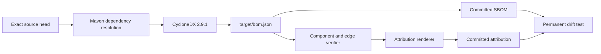

# KRW 2B Sale-Readiness Evidence

Original evidence date: 2026-07-02  
Original verification source head: `7df3ac8b8253cd1a445ba7faddbf99bc9a5c5fcd`  
Latest dependency-evidence refresh: 2026-08-05  
Netty SBOM generation source head: `3b6e43426790ab8590c9ef50656bfb5cbbb206ce`

## Evidence Boundary

This directory combines a historical sale-readiness snapshot with selected generated artifacts that remain under executable drift contracts. A `Pass` result describes the named artifact and its source revision; it is not automatically transferable to a later source head.

The committed CycloneDX JSON and generated third-party attribution are shareable buyer data-room evidence. GitHub Actions logs and the one-day generation artifact are transient provenance. Any dependency change must regenerate the SBOM, attribution, hashes, and exact-head acceptance evidence before release.

## Gate Summary

| Gate | Result | Evidence |
| --- | --- | --- |
| Java runtime | Pass for original snapshot, Java 26.0.1 runtime with Java 21 release-target compile | `java-version.txt`, `compile.log` |
| Compile warnings/deprecations | Pass for original snapshot | `compile.log` |
| Tests + JaCoCo | Pass for original snapshot, 357 tests, `classes=49`, `line_missed=0`, `branch_missed=0` | `mvn-test.log`, `test-jacoco.log`, `jacoco.csv`, `jacoco-status.txt` |
| JavaDoc | Pass for original snapshot, `javadoc_warnings_or_errors=none` | `javadoc.log`, `javadoc-status.txt` |
| Markdown lint | Pass for original snapshot, 0 errors across changed docs | `markdownlint.log` |
| JS syntax | Pass for original snapshot | `node-check.log` |
| SAST | Pass for original snapshot, 0 findings | `semgrep.log`, `semgrep.json` |
| SBOM | Refreshed 2026-08-05, CycloneDX 1.6, 61 components, 17 Netty components at `4.1.136.Final`, 0 components without license metadata | `sbom-cyclonedx.json`, Netty ADR, permanent drift test |
| License review | Pass for current 61-component generated SBOM; 0 review-required and 0 unlisted violations under buyer-release policy | `docs/security/2026-07-02-license-allowlist-review.md`, `license-policy-summary.json`, `license-policy-test.log` |
| Third-party attribution | Refreshed from the same generated SBOM and protected by byte-for-byte renderer drift validation | `docs/legal/2026-07-03-third-party-attribution.md`, `scripts/test_render_third_party_attribution.py` |
| Buyer data-room manifest | Pass for original snapshot; required local paths existed and ready gates cited only ready artifacts | `docs/diligence/2026-07-03-buyer-data-room-manifest.json`, `buyer-dataroom-manifest-check.log` |
| Buyer readiness scorecard | Pass for original snapshot; 23 artifacts, 8 readiness gates, 38 percent conservative gate readiness | `docs/diligence/2026-07-03-buyer-readiness-scorecard.md`, `buyer-readiness-scorecard-summary.json` |
| Figma Slides generation payload | Pass for payload scope; 11 slides, 4 objectives, 0 errors; actual Slides generation still requires an eligible Figma plan | `docs/design/2026-07-03-buyer-diligence-slides-generation-payload.json`, `figma-deck-payload-check.json` |
| Auth/tenant, signed artifacts, and KPI snapshots | Partial; runtime tenant enforcement, signed claims, signed artifact tokens, revocation, audit, and file-backed ledgers exist, while production OIDC/JWT and centralized durable persistence remain pending | Security model, artifact, analytics, and persistence tests |
| Buyer deployment integration | Pass for buyer sandbox scope; connector seed, gateway-signed claims, smoke path, and cutover gates documented | Buyer deployment playbook, connector OpenAPI, buyer-demo profile |
| Durable job repository and recovery slice | Partial; code boundary, state store, lifecycle events, and process-local recovery exist, while SQL process-restart durability remains pending | Persistence plan and repository/state-store tests |
| Seeded buyer-demo screenshots | Pass for local screenshot scope; desktop/mobile seeded story, no mobile overflow | Seeded demo verification and screenshots |
| Buyer diligence closure map | Pass for FigJam handoff scope | Design handoff documentation |
| Local smoke | Pass for original signed-tenant, artifact-ledger, KPI-ledger, viewer, revocation, and recovery scope | `smoke-local.txt`, `smoke-app.log`, `smoke-ui-root.txt` |
| GitHub PR state | Dynamic; queued or waiting review does not stop productive work but is never counted as merge acceptance | Current exact-head PR checks and reviews |

## SAST

Command used for the original evidence snapshot:

```bash
uvx semgrep --config p/java --metrics=off --error --json \
  --output docs/qa/evidence/2026-07-02-krw2b-sale-readiness/semgrep.json \
  src/main/java src/test/java
```

Result:

- Semgrep completed successfully.
- Rules run: 60 Java rules.
- Targets scanned: 56 tracked files.
- Findings: 0.
- Errors: 0.

Evidence: `semgrep.json`.

## SBOM Generation

### Canonical command

```bash
mvn -B --no-transfer-progress -DskipTests \
  org.cyclonedx:cyclonedx-maven-plugin:2.9.1:makeAggregateBom \
  -Dcyclonedx.skipAttach=true \
  -DoutputFormat=json \
  -DoutputName=bom
```

CycloneDX Maven Plugin 2.9.1 writes the canonical JSON output to `target/bom.json`. `outputFormat` and `outputName` are Maven user properties without a `cyclonedx.` prefix. The earlier evidence command incorrectly prefixed those two properties and is superseded by this contract.

### Deterministic provenance

Read-only workflow run `31004040777` generated the accepted dependency evidence at `2026-08-05T12:07:15Z`.

| Field | Value |
| --- | --- |
| Source head | `3b6e43426790ab8590c9ef50656bfb5cbbb206ce` |
| Generator | `org.cyclonedx:cyclonedx-maven-plugin:2.9.1:makeAggregateBom` |
| Artifact ID | `8929593015` |
| Artifact archive SHA-256 | `07a0325e08157f00dda28c58ed4e41af51863cccb2ceea2c4e378ead77dc337f` |
| SBOM SHA-256 | `e138a9263edb40c613d5f159acba8fa89ee848a7cef4b6619e095c48451b095c` |
| Attribution SHA-256 | `e19a3767a545bd059e50003882d8ff2f8a3ff4d3b8fd28d3f305eead61261da9` |
| CycloneDX specification | `1.6` |
| Total components | `61` |
| Netty components | `17` |
| Netty version set | exactly `4.1.136.Final` |
| Components without license metadata | `0` |



The verifier requires every Netty component version, purl, bom-ref, and dependency edge to resolve to `4.1.136.Final`. It rejects the historical `4.1.135.Final` line, an empty component list, unmatched dependency references, or attribution that cannot be reproduced from the committed JSON.

### Current generated result

- CycloneDX BOM format: 1.6.
- Components: 61.
- Components without license metadata: 0.
- Unique license metadata entries: 3.
- The unused `tika-parsers-standard-package` dependency remains absent, eliminating Tika transitive review-required components `jhighlight`, `junrar`, and `juniversalchardet` from the buyer-release graph.
- Spring Boot's default Logback starter is replaced with `spring-boot-starter-log4j2`, and `jakarta.annotation-api` remains excluded from the current starter paths.
- The standard-library attribution renderer generates `docs/legal/2026-07-03-third-party-attribution.md` from the same SBOM.
- The buyer-release license policy records 61 allowed components, 0 review-required components, and 0 unlisted violations.

Primary generated evidence:

- `sbom-cyclonedx.json`
- `docs/legal/2026-07-03-third-party-attribution.md`
- `docs/security/2026-08-05-netty-4.1.136-remediation.md`
- `scripts/test_render_third_party_attribution.py`
- `src/test/java/com/clearfolio/viewer/config/DependencyPolicyTest.java`

Related historical and buyer-handoff evidence:

- `sbom-cyclonedx.log`
- `sbom-status.txt`
- `license-policy.log`
- `license-policy-summary.json`
- `license-policy-test.log`
- `third-party-attribution-check.log`
- `buyer-dataroom-manifest-check.log`
- `buyer-readiness-scorecard-summary.json`
- `figma-deck-payload-check.json`
- `docs/design/2026-07-03-buyer-diligence-slides-generation-payload.json`
- `docs/security/2026-07-02-license-allowlist-review.md`
- `docs/security/2026-07-02-license-policy.json`
- `docs/security/2026-07-02-auth-tenant-model.md`
- `docs/deployment/2026-07-02-buyer-deployment-integration-playbook.md`
- `docs/deployment/clearfolio-buyer-connector.openapi.yaml`
- `src/main/resources/application-buyer-demo.yml`
- `docs/persistence/2026-07-02-durable-conversion-job-repository-plan.md`
- `src/main/java/com/clearfolio/viewer/repository/ConversionJobStateStore.java`
- `src/main/java/com/clearfolio/viewer/repository/ConversionJobRepository.java`
- `src/main/java/com/clearfolio/viewer/repository/ConversionJobLifecycleEvent.java`
- `src/main/java/com/clearfolio/viewer/repository/RepositoryBackedConversionJobStateStore.java`
- `docs/superpowers/plans/2026-07-02-conversion-job-lifecycle-events.md`
- `docs/superpowers/plans/2026-07-03-conversion-recovery-sweep.md`
- `buyer-deployment-slice-verification.md`

FigJam handoff includes the gateway signed-tenant flow, KPI snapshot ledger/export flows, buyer-demo KPI panel, operator recovery flow, conversion state-store and lifecycle-event flows, buyer readiness gate map, diligence slides storyboard, ready-gate evidence integrity check, and conversion recovery sweep flow.

## Local Smoke

Original command path:

- Start the application on a random local port with `clearfolio.tenant-claims.hmac-secret`, `clearfolio.artifact-link-ledger.path`, and `clearfolio.analytics-snapshot-ledger.path` configured.
- Verify the root shell, buyer-demo KPI and recovery panels, demo assets, signed claims, upload and status polling, viewer/bootstrap, signed and ranged artifact access, read audit, revocation, cross-tenant concealment, KPI snapshots and exports, and file-backed ledger append evidence.

Original result:

- Runtime Java: 21.0.11.
- Root shell: 200; evidence and recovery panels present.
- Missing or unsigned tenant claims: 401.
- Authenticated empty KPI and exports: 200.
- Final conversion status: `SUCCEEDED` for tenant `buyer-demo`.
- Viewer and bootstrap: 200.
- Signed artifact range read: 206; unsigned read: 401.
- Artifact read audit: 200; revocation succeeded; revoked read: 403.
- Cross-tenant status lookup: 404.
- Post-upload KPI: one successful job and numeric preview latency.
- Artifact and KPI ledger append evidence present.

Evidence:

- `smoke-local.txt`
- `smoke-ui-root.txt`
- `smoke-app.log`

## GitHub Acceptance

The historical snapshot is not a substitute for current pull-request evidence. A release or merge requires the exact current head to pass repository CI, Maven `verify`, zero missed production lines and branches, warning-free public Javadocs, Security Scan, SAST, every fuzz target, dependency/security review, current automated review, zero unresolved threads, and a counted independent approval. Queued, pending, cancelled, skipped-required, stale-head, or local-only results are not passing.
