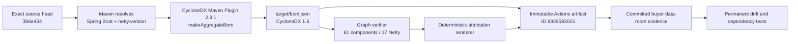

# ADR: Align the Reactive HTTP Stack on Netty 4.1.136.Final

- **Status:** Accepted
- **Decision date:** 2026-08-05
- **Decision owners:** Clearfolio maintainers and security reviewers
- **Applies to:** `clearfolio-viewer` reactive HTTP runtime and every transitive `io.netty` module managed through Spring Boot

## Context

Clearfolio uses Spring Boot WebFlux, which resolves Reactor Netty and the Netty transport, codec, resolver, and handler modules transitively. Spring Boot 3.5.16 manages the Netty 4.1 line at `4.1.135.Final`. Exact-head Strix run `30997430437`, job `92277868841`, reported a HIGH dependency finding against that line and identified `4.1.136.Final` as the fixed 4.1 release.

The Netty project released `4.1.136.Final` at 20:18 UTC on July 8, 2026. Its primary release record includes HTTP/1.1 and HTTP/2 boundary validation, MQTT decoder and UTF-8 validation, compression safety, parser-boundary, flow-control, and traffic-shaping fixes relative to `4.1.135.Final`.

A partial dependency override would be unsafe because Netty is a coordinated family of modules. Mixing codec, transport, resolver, and handler patch levels can create an unreviewed runtime graph even when Maven resolves successfully.

## Decision

Set the Spring Boot-supported Maven property below in the root `pom.xml`:

```xml
<netty.version>4.1.136.Final</netty.version>
```

This property changes the managed version for the complete Netty module family while retaining Spring Boot's dependency-management structure. Do not pin individual Netty artifacts independently unless an accepted follow-up ADR proves that a mixed module graph is required and compatible.

Two executable contracts guard the decision:

- `DependencyPolicyTest.pomPinsPatchedNettyLineForReactiveHttpServing` reads the real root POM through an XML parser configured to reject document types, external entities, parameter entities, XInclude, and entity expansion.
- `scripts/test_render_third_party_attribution.py` independently reads the single nonblank `netty.version` property, then proves that every committed Netty component version, purl, bom-ref, dependency edge, and attribution row resolves to that version.

## Deterministic buyer-evidence flow

The committed SBOM is generated evidence, not a hand-edited dependency inventory. The accepted generation path is:



The exact generation command is:

```bash
mvn -B --no-transfer-progress -DskipTests \
  org.cyclonedx:cyclonedx-maven-plugin:2.9.1:makeAggregateBom \
  -Dcyclonedx.skipAttach=true \
  -DoutputFormat=json \
  -DoutputName=bom
```

The plugin writes the canonical JSON document to `target/bom.json`. The `outputFormat` and `outputName` parameters are Maven user properties without a `cyclonedx.` prefix; only `cyclonedx.skipAttach` uses that prefix in this invocation.

## Evidence record

Read-only workflow run `31004040777` generated the accepted evidence from source head `3b6e43426790ab8590c9ef50656bfb5cbbb206ce` at `2026-08-05T12:07:15Z`.

- Artifact ID: `8929593015`
- Artifact archive SHA-256: `07a0325e08157f00dda28c58ed4e41af51863cccb2ceea2c4e378ead77dc337f`
- CycloneDX version: `1.6`
- Total components: `61`
- Netty components: `17`
- Netty version set: exactly `4.1.136.Final`
- SBOM SHA-256: `e138a9263edb40c613d5f159acba8fa89ee848a7cef4b6619e095c48451b095c`
- Attribution SHA-256: `e19a3767a545bd059e50003882d8ff2f8a3ff4d3b8fd28d3f305eead61261da9`

The graph verifier proved that every Netty dependency reference has a corresponding current Netty component ref and that `4.1.135.Final` is absent from both generated files. The attribution renderer was rerun from the generated JSON and matched the committed Markdown byte contract.

The committed SBOM and attribution are shareable buyer evidence. Workflow logs and the one-day artifact are transient generation provenance and must not be presented as durable data-room evidence after expiry. Reproduction therefore depends on the documented command, exact source revision, immutable plugin version, committed hashes, permanent drift tests, and fresh exact-head CI.

## Security and compatibility boundaries

- The override changes only the Netty patch line. It does not change Spring Boot, Spring Framework, Reactor, or the public Clearfolio API.
- Maven must resolve all applicable `io.netty` modules to `4.1.136.Final`; stale modules at `4.1.135.Final` or an older version are a release blocker.
- Existing zero-missed-line and zero-missed-branch JaCoCo gates, compiler warnings-as-errors, fuzzing, SAST, dependency review, OSV, Trivy, Scorecard, Strix, and independent review remain mandatory.
- A successful unit-test run does not replace dependency-tree and security-scanner evidence.
- The override must not be copied into downstream modules as separate ad hoc pins. Standalone builds inherit the root property; modular consumers should use a versioned BOM or equivalent explicit contract.
- The evidence record describes the dependency graph of its exact generation head. Any dependency change requires regeneration and a new evidence hash record.

## Verification

For the exact pull-request head:

1. Run `mvn -B --no-transfer-progress verify`.
2. Run `mvn -B --no-transfer-progress dependency:tree -Dincludes=io.netty` and confirm one coherent `4.1.136.Final` line for every applicable Netty module.
3. Run `python3 scripts/test_render_third_party_attribution.py` and require the generated graph and attribution drift contract to pass.
4. Require successful CI, Security Scan, SAST Semgrep, every fuzz target, CodeRabbit, Strix, OpenCode, and Noema evidence for the same head.
5. Reject queued, cancelled, skipped-required, stale-head, local-only, or manually inferred results.
6. Preserve an independent approving review that GitHub counts under protected-branch rules.

## Removal and upgrade rule

Keep this override until one of the following occurs:

- the Spring Boot parent used by Clearfolio manages Netty `4.1.136.Final` or a later reviewed compatible release; or
- Clearfolio moves to a different supported reactive HTTP stack through an accepted architecture decision.

Removing or increasing the override requires the same exact-head dependency-tree, compatibility, security, coverage, SBOM regeneration, and review evidence. A newer version number alone is not proof of compatibility.

## Consequences

### Positive

- The complete Netty family moves to one reviewed fixed 4.1 patch line.
- The remediation uses Spring Boot's documented version-property mechanism rather than fragile per-artifact pins.
- Real-project and generated-evidence contracts prevent silent dependency or data-room drift.
- Exact generation provenance, hashes, and local-versus-shareable evidence boundaries remain auditable for acquisition diligence.

### Trade-offs

- Clearfolio temporarily diverges from the Netty patch version selected by Spring Boot 3.5.16.
- The project must retain explicit exact-head compatibility and scanner evidence until the parent line catches up.
- A future parent upgrade must reconcile this property deliberately and regenerate the buyer evidence.

## References

CycloneDX Project. (n.d.). *CycloneDX Maven plugin* [Source code]. GitHub. Retrieved August 5, 2026, from https://github.com/CycloneDX/cyclonedx-maven-plugin

Netty Project. (2026, July 8). *Netty 4.1.136.Final* [Software release]. GitHub. https://github.com/netty/netty/releases/tag/netty-4.1.136.Final

OWASP Foundation. (2024, April 9). *CycloneDX 1.6* [Software bill of materials specification]. https://github.com/CycloneDX/specification/releases/tag/1.6

Spring. (n.d.). *Managed dependency coordinates: Spring Boot 3.5.16*. Retrieved August 5, 2026, from https://docs.spring.io/spring-boot/3.5/appendix/dependency-versions/coordinates.html

Spring. (n.d.). *Version properties: Spring Boot 3.5.16*. Retrieved August 5, 2026, from https://docs.spring.io/spring-boot/3.5/appendix/dependency-versions/properties.html
