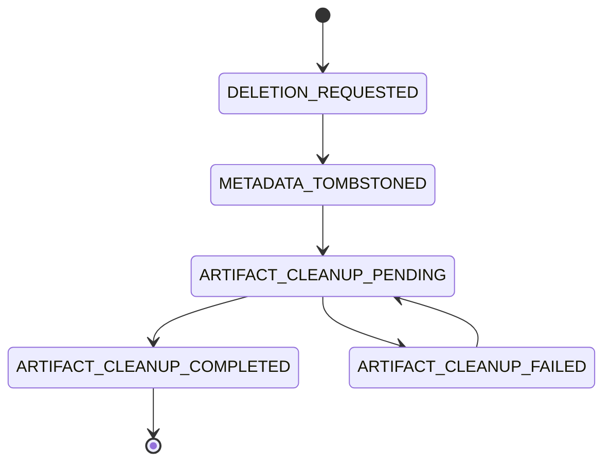

# Durable artifact-deletion receipt boundary

- **Status:** Accepted foundation; HTTP mutation and cleanup-worker integration remain future slices.
- **Decision date:** 2026-08-06
- **Owner issue:** #263
- **Format version:** `RECEIPT_V1`

## Decision

Clearfolio records each accepted artifact-deletion lifecycle as immutable,
versioned receipt snapshots. The reference adapter is an append-only UTF-8 ledger
that forces each snapshot to storage before returning. A standalone caller may
use the in-memory constructor, while the Spring application defaults to
`data/artifact-deletion-receipts.log` so pending evidence can be replayed after a
process restart.

This foundation does **not** yet change the administrative DELETE response, move
job tombstoning and receipt creation into one transaction, revoke signed links,
or run an artifact-cleanup worker. Those are separate bounded slices under
issue `#263`. Until they integrate, the existing delete path remains best effort
and the CodeRabbit incomplete-cleanup finding must remain open.

## Immutable receipt identity

One receipt identity contains:

- `request_id`: deletion idempotency identifier;
- `tenant_id`: tenant that owned the conversion job;
- `job_id`: permanently reserved conversion-job identifier;
- `artifact_checksum`: lowercase SHA-256 digest for the exact artifact bytes;
- `audit_correlation_id`: privacy-safe correlation value, never a raw subject,
  tenant secret, token, filename, or document value;
- `requested_at`: durable request time.

A repeated request returns the existing object only when every immutable field
matches. A different request, tenant, artifact digest, audit correlation, or
request time for the same `job_id` fails closed. This complements #268's
permanent UUID reservation and prevents cleanup work from being rebound to a
new tenant or artifact generation.

## Monotonic lifecycle

Every snapshot records `state_changed_at`. Time cannot move backward relative to
the previous durable transition. `ARTIFACT_CLEANUP_COMPLETED` is terminal.
Failures increment `attempt_count`, record `last_attempt_at`, and accept only a
controlled lowercase code matching `[a-z0-9_]{1,64}`. Exception messages,
storage paths, raw identifiers, stack traces, and document metadata are not
valid failure codes.

Attempt evidence is internally consistent and immutable across replay:

- `attempt_count == 0` requires absent `last_attempt_at`;
- `attempt_count > 0` requires a `last_attempt_at` no later than
  `state_changed_at`;
- requested and metadata-tombstoned receipts cannot claim cleanup attempts;
- only pending-to-failed increments the count and advances `last_attempt_at`;
- retry-pending and completed snapshots preserve the prior count and latest
  attempt instant exactly.

A replayed snapshot that erases, rewrites, advances, or invents attempt evidence
outside those transitions fails closed.

## Persistence and replay

The reference file adapter applies the following contract:

1. serialize one complete `RECEIPT_V1` snapshot;
2. encode variable text fields as Base64URL and separate fields with tabs;
3. reject records longer than 16 KiB during replay;
4. write the full record and a fixed ASCII LF (`0x0A`) terminator through one
   append-only file channel, treating LF as the record commit delimiter;
5. call `FileChannel.force(true)` before exposing the transition as durable;
6. replay only delimiter-committed records with bounded, strict UTF-8 decoding;
7. reject any non-empty unterminated final tail instead of interpreting a
   potentially torn or pre-force append as durable evidence;
8. validate record shape, immutable identity, state timestamps, attempt evidence,
   and legal predecessor-to-successor transitions;
9. fail application construction on malformed, conflicting, oversized,
   unterminated, or non-monotonic evidence.

A missing ledger file means an empty store. A malformed existing file or
unterminated final record is not silently skipped, truncated, or replayed.
Startup does not mutate audit evidence as an implicit recovery action; operators
must preserve the original bytes and use a controlled, reviewable recovery
procedure. Completed receipts are retained for audit and idempotency but
excluded from the pending-work view.

## Modular and MSA contract

`ArtifactDeletionReceiptStore` is the versioned service boundary. An external
PostgreSQL, event-store, or message-broker adapter may replace the file ledger,
but it must preserve:

- one permanently reserved `job_id` lifecycle;
- exact immutable request identity;
- tenant and artifact-digest binding;
- monotonic state and time;
- idempotent duplicate requests;
- controlled privacy-safe failure evidence;
- restart-replay of pending and failed work;
- terminal completion retention;
- fail-closed conflict behavior.

Future database objects must use descriptive two-or-more-word `snake_case`
names, including `deletion_request`, `deletion_receipt`,
`artifact_cleanup_task`, `job_tombstone`, and `audit_event`.

## Required next slices

### Atomic tombstone and outbox

Create the receipt, metadata tombstone, and cleanup task in one durable
transaction. A crash must not leave a tombstone without a replayable task or a
task without an authorized tombstone.

### Exact-generation cleanup worker

The worker must revalidate tenant, `job_id`, artifact checksum or storage
generation, receipt state, and revocation state before deletion. Stale receipts
must be rejected rather than deleting newer bytes.

### Truthful API and accessible UI

The product must distinguish accepted, cleanup pending, cleanup failed, and
completed states. It must never return a completed deletion while confidential
artifact bytes or valid signed links remain available.

## Verification requirements

- exact duplicate request object identity;
- conflicting same-job requests fail closed;
- every legal and illegal transition;
- nondecreasing transition timestamps;
- internally consistent and transition-preserved attempt evidence;
- controlled failure-code validation;
- attempt-count persistence across retries and restart;
- strict UTF-8, malformed-line, oversized-line, conflicting-replay, and
  unterminated-final-tail rejection;
- fixed host-independent LF record delimiters;
- completed receipts excluded from pending work but retained after restart;
- production line and branch coverage of 100%;
- complete beginner-readable public Javadocs;
- exact-head CI, Security Scan, SAST, fuzzing, independent review, and protected
  merge evidence before integration.

## References

Fielding, R., Nottingham, M., & Reschke, J. (2022). *HTTP semantics* (RFC 9110;
STD 97). Internet Engineering Task Force. https://www.rfc-editor.org/rfc/rfc9110

National Institute of Standards and Technology. (2024). *Protecting controlled
unclassified information in nonfederal systems and organizations* (NIST Special
Publication 800-171, Revision 3). U.S. Department of Commerce.
https://doi.org/10.6028/NIST.SP.800-171r3

OWASP Foundation. (2023). *API1:2023 broken object level authorization*. In
*OWASP API Security Top 10—2023*.
https://owasp.org/API-Security/editions/2023/en/0xa1-broken-object-level-authorization/
