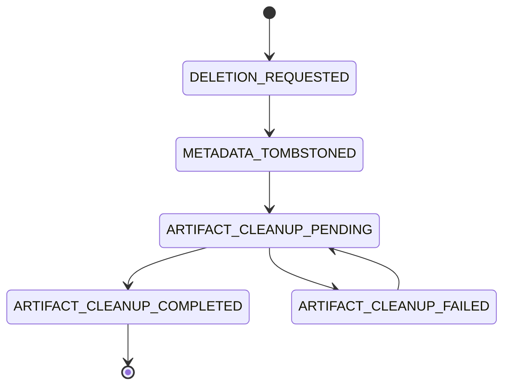

# Durable artifact-deletion lifecycle

- **Status:** Integrated reference implementation
- **Decision date:** 2026-08-06
- **Owner issue:** #263
- **Format version:** `RECEIPT_V1`

## Decision

Clearfolio records every accepted artifact-deletion lifecycle as immutable,
versioned receipt snapshots before removing conversion-job metadata. The Spring
runtime uses an append-only file ledger at
`data/artifact-deletion-receipts.log`, while standalone and test consumers may
use the in-memory adapter behind the same `ArtifactDeletionReceiptStore`
contract.

`DefaultDocumentConversionService` delegates tenant-scoped and legacy deletion
to `ArtifactDeletionCoordinator`. The coordinator persists deletion intent,
tombstones metadata, attempts byte cleanup, records controlled failure evidence,
and recovers incomplete work after startup and on a bounded fixed-delay
schedule. A storage exception is no longer reduced to a log line and lost.

The reference implementation closes the process-local and restart-loss gap that
caused CWE-459 orphaned document bytes. A future database deployment should
still replace the file ledger and metadata repository with one transactional
outbox transaction. The current receipt-first ordering is crash recoverable but
does not claim cross-resource ACID atomicity.

## Authorization and immutable identity

Tenant deletion begins with `findByTenantAndId`. Missing and cross-tenant
identifiers return `false` before the artifact store or receipt store is read.
Only the already-authorized tenant and permanently reserved conversion-job UUID
enter the deletion lifecycle.

One receipt identity contains:

- `request_id`: deletion idempotency identifier;
- `tenant_id`: tenant that owned the conversion job;
- `job_id`: permanently reserved conversion-job identifier;
- `artifact_checksum`: lowercase SHA-256 digest for the observed artifact bytes;
- `audit_correlation_id`: random privacy-safe lifecycle correlation;
- `requested_at`: durable request time.

Raw subjects, filenames, tokens, storage paths, exception messages, and document
content never enter the receipt or metric tags. A repeated request is accepted
only when tenant, job, checksum, correlation, and time identify the same durable
request. Conflicting identity fails closed.

## Monotonic lifecycle

Every snapshot records `state_changed_at`; time cannot move backward and
`ARTIFACT_CLEANUP_COMPLETED` is terminal. Failures increment `attempt_count`,
record `last_attempt_at`, and accept only controlled lowercase codes matching
`[a-z0-9_]{1,64}`. Current coordinator codes are:

- `artifact_store_read_failed`;
- `artifact_store_delete_failed`;
- `artifact_checksum_mismatch`.

The ledger rejects inconsistent attempt evidence, illegal successors,
non-monotonic timestamps, unsafe failure details, malformed identity, and
attempt erasure across retry or completion.

## Receipt-first deletion flow

1. Resolve tenant ownership at the repository boundary.
2. Read the current artifact before metadata mutation.
3. Bind a present artifact to SHA-256. Bind absence to the SHA-256 digest of the
   empty byte sequence.
4. Force the `DELETION_REQUESTED` receipt to durable storage.
5. Tombstone metadata without releasing the UUID reservation.
6. Force `METADATA_TOMBSTONED` and `ARTIFACT_CLEANUP_PENDING`.
7. Re-read the artifact before deletion. A non-empty expected digest must match.
8. Delete bytes and metadata sidecar through `ArtifactStore.deletePdf`.
9. Force `ARTIFACT_CLEANUP_COMPLETED`, or force one controlled failed state for
   later retry.

The empty digest is an explicit absence sentinel. If a conversion worker writes
late bytes after the initial absent snapshot, the permanently reserved job UUID
proves that those bytes still belong to the tombstoned lifecycle, so the
coordinator removes them. A non-empty mismatched digest is retained and flagged
instead of deleting bytes that cannot be proven to match the receipt.

## Persistence and crash recovery

Each complete `RECEIPT_V1` snapshot is encoded as bounded strict UTF-8,
Base64URL-encodes variable text, uses tab-separated fields and one fixed ASCII
LF commit delimiter, and is appended through `FileChannel`. The ledger calls
`force(true)` before exposing the transition as durable.

Startup replay rejects malformed Base64URL, invalid state, timestamp or count,
immutable-identity conflicts, oversized records, illegal transitions, and every
non-empty unterminated final tail. It never silently truncates forensic evidence.
A missing ledger means an empty store; a malformed existing ledger prevents
startup.

`ArtifactDeletionCoordinator` replays every nonterminal state:

- `DELETION_REQUESTED`: confirm or apply the tenant metadata tombstone;
- `METADATA_TOMBSTONED`: queue cleanup;
- `ARTIFACT_CLEANUP_PENDING`: retry the interrupted attempt;
- `ARTIFACT_CLEANUP_FAILED`: return to pending and retry;
- `ARTIFACT_CLEANUP_COMPLETED`: perform no work.

Recovery is serialized in the reference process and bounded by
`clearfolio.artifact-deletion-cleanup.max-receipts-per-run`, default `100`.
Scheduled retry uses
`clearfolio.artifact-deletion-cleanup.retry-delay-ms`, default `30000`.
Confidential-byte cleanup has no terminal retry count; operators must alert on
persistent failure rather than discard the receipt.

## Metrics and privacy

Micrometer registers:

- `clearfolio.artifact.deletion.attempts{outcome="completed"}`;
- `clearfolio.artifact.deletion.attempts{outcome="failed"}`;
- `clearfolio.artifact.deletion.pending`.

Only the fixed `outcome` label is used. These meters can be exported through a
Micrometer-compatible OpenTelemetry registry without changing the coordinator.
No high-cardinality or secret-bearing value is used as a tag.

## Modular and MSA contract

`ArtifactDeletionReceiptStore`, `ConversionJobRepository`, and `ArtifactStore`
remain replaceable boundaries. PostgreSQL, event-store, object-store, queue, or
remote-service adapters must preserve:

- tenant authorization before lookup or mutation;
- one permanently reserved `job_id` lifecycle;
- exact immutable request identity and idempotency;
- artifact digest or generation binding;
- monotonic state and time;
- controlled privacy-safe failure evidence;
- restart-safe pending-work replay;
- bounded consumer backpressure;
- terminal completion retention;
- fail-closed conflict behavior.

Database objects must contain at least two descriptive words and use
`snake_case`, including `artifact_deletion_receipt`, `artifact_cleanup_task`,
`conversion_job_tombstone`, and `deletion_audit_event`.

## Remaining acquisition-readiness work

The next bounded database slice should commit job tombstone, deletion receipt,
and cleanup outbox task in one transaction. A remote object-store adapter should
bind deletion to an immutable object version or generation instead of relying
only on byte digest. The product API and accessible viewer should additionally
surface accepted, pending, failed, and completed deletion states rather than
representing metadata tombstoning as full physical completion.

Release evidence still requires the integrated exact head to pass full Maven
verification, zero skipped tests, 100% production statement and branch coverage,
warning-free public Javadocs, CI, Security Scan, SAST, fuzzing, Strix,
CodeRabbit, OpenCode/Noema, and independent protected-branch approval.

## Verification requirements

The deterministic suite covers tenant concealment, successful completion,
read-before-mutation failure, durable delete failure, controlled failure codes,
restart replay, already-tombstoned recovery, pending-at-crash recovery, digest
mismatch, absence-sentinel late writes, bounded batches, fixed metric tags,
invalid configuration, idempotent duplicates, conflicting identities, every
legal and illegal ledger transition, strict UTF-8, oversized input,
unterminated-tail rejection, and completed-receipt retention.

## References

Fielding, R., Nottingham, M., & Reschke, J. (2022). *HTTP semantics* (RFC 9110;
STD 97). Internet Engineering Task Force. https://www.rfc-editor.org/rfc/rfc9110

National Institute of Standards and Technology. (2024). *Protecting controlled
unclassified information in nonfederal systems and organizations* (NIST Special
Publication 800-171, Revision 3). U.S. Department of Commerce.
https://doi.org/10.6028/NIST.SP.800-171r3

OWASP Foundation. (2023). *API1:2023 broken object level authorization*. In
*OWASP API Security Top 10—2023*.
https://owasp.org/API-Security/editions/2023/en/0xa1-broken-object-level-authorization/
